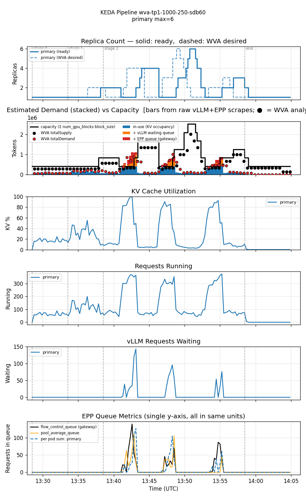
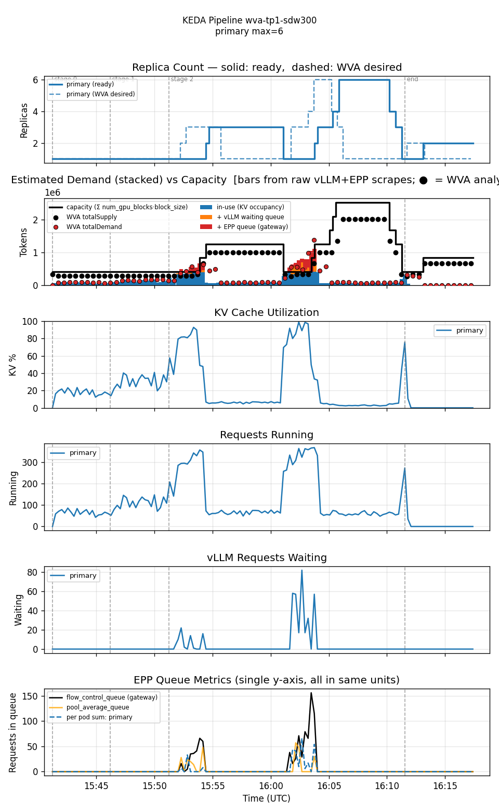
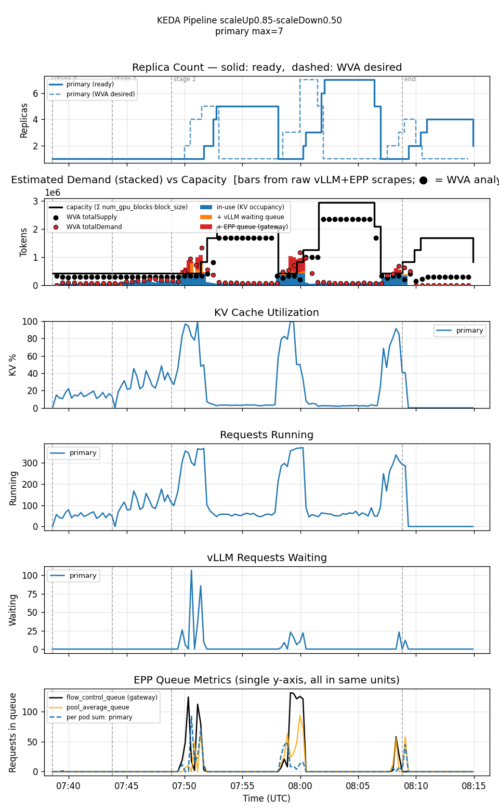
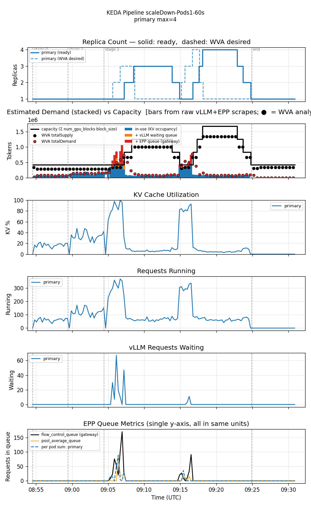
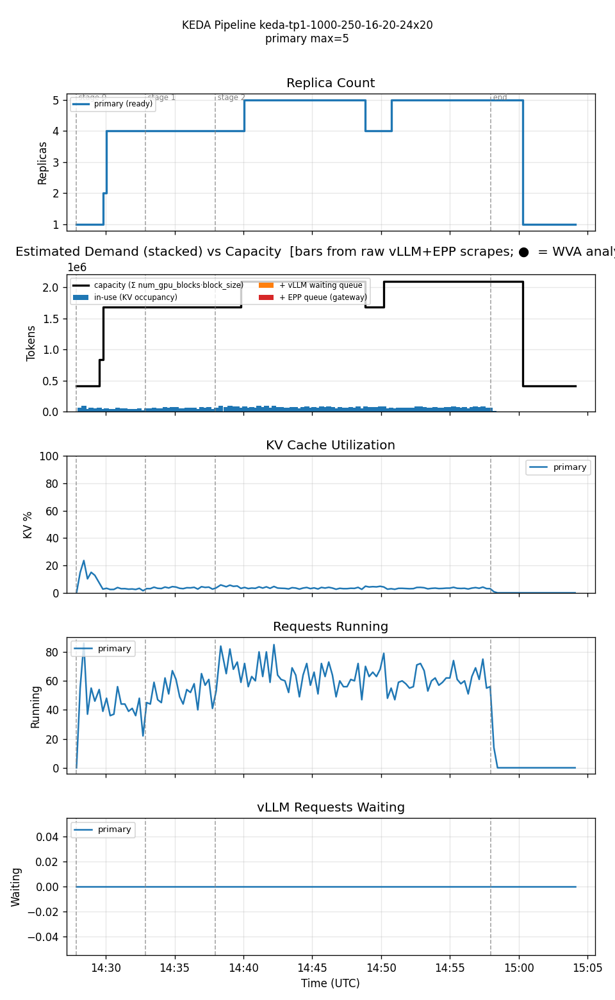

<!--
Table formatting rules for this doc (keep alignment readable in the raw editor):
  1. Every cell has exactly one space of padding inside the pipes (`| cell |`).
  2. Within a table, every row uses the SAME column widths. Widen a column to
     fit its widest cell — don't leave short cells un-padded.
  3. Text columns are left-aligned; numeric columns are right-aligned.
  4. The separator row uses dashes only, with a length matching the column width.
  5. Do not vary column widths between the header, separator, and data rows.
  Regenerate all tables via `hack/format-tables.py` if adding/removing rows.
-->

# Single-variant WVA (Sat-2) vs KEDA-EPP — 1000/250 tokens, sustained crossover-rate load

Date: 2026-07-28 (WVA su=0.85/sdb=0.50 and scaleDown=Pods1/60s legs added 2026-07-29)
Namespace: `biran` (pokprod001)
Model: `unsloth/Meta-Llama-3.1-8B-Instruct`
Harness: inference-perf v0.7.0

Every prior comparison in this series used short (5-minute) stages, long enough to see a single overshoot-and-correct cycle but not long enough to see whether the system *converges* under sustained load. This doc extends the final stage to 20 minutes at rate=24 — a rate just past the crossover point identified in [`comparison-1000x250-r16x40-20260728`](../comparison-1000x250-r16x40-20260728/comparison.md) — specifically to answer: does WVA settle into a stable replica count, or does it keep oscillating indefinitely?

Four WVA legs are included. The first two are both at `scaleDownBoundary=0.60` (down from 0.70 elsewhere in this series): one at KEDA's default `scaleDown.stabilizationWindowSeconds=120`, one with that window extended to `300` — testing whether a longer scale-down delay damps the oscillation rather than just changing its shape. The third leg keeps the window at `300` but widens the hysteresis gap itself: `scaleUpThreshold=0.85` (up from 0.75), `scaleDownBoundary=0.50` (down from 0.60) — testing whether a wider dead zone between the scale-up and scale-down triggers, rather than a longer post-peak hold, is what actually damps the cycling. The fourth leg reverts to the baseline thresholds (`scaleUpThreshold=0.75`/`scaleDownBoundary=0.60`, window `300s`) and instead changes the KEDA `ScaledObject`'s `scaleDown` **policy magnitude** — from `Percent 100` (unlimited drop per 15s window — an N→1 cliff in a single step) to `Pods 1` per 60s (at most one pod removed per minute) — testing whether a gradual drain, rather than any threshold or window tuning, is what actually breaks the cycle.

## Setup

Single TP=1 decode deployment (1 GPU/pod), all five legs min=1/max=10. WVA (all four legs): `eppQueueDemandMultiplier=2.0`. KEDA-EPP: `scaledobject-t50.yaml` (queue threshold=50/pod avg, running-requests threshold=16/pod avg).

The four WVA legs differ only in the live-patched `wva-saturation-scaling-config` ConfigMap and the KEDA `ScaledObject`'s `advanced.horizontalPodAutoscalerConfig.behavior.scaleDown` block:

| WVA leg              | scaleUpThreshold | scaleDownBoundary | scaleDown window | scaleDown policy  |
|----------------------|------------------|-------------------|------------------|-------------------|
| sdw=120s (baseline)  |             0.75 |              0.60 | 120s             | Percent 100 / 15s |
| sdw=300s             |             0.75 |              0.60 | 300s             | Percent 100 / 15s |
| su=0.85/sdb=0.50     |             0.85 |              0.50 | 300s             | Percent 100 / 15s |
| scaleDown=Pods 1/60s |             0.75 |              0.60 | 300s             | **Pods 1 / 60s**  |

None of these are exposed by `add_variant.py` as flags; the ConfigMap was patched via `kubectl patch configmap wva-saturation-scaling-config`, the `ScaledObject`'s window/policy via a direct live patch, both confirmed to propagate to the controller (config re-read on next reconcile) and to the underlying native `HorizontalPodAutoscaler` object (`oc get hpa -o jsonpath='{.spec.behavior.scaleDown}'`) respectively. The WVA controller was restarted before each leg to flush in-memory k2 saturation history.

**Workload** (`prefill_heavy_1000_250_16_20_24x20`, Poisson arrival): input ≈1000 tokens, output ≈250 tokens. 3 stages: 5 min @ rate 16, 5 min @ rate 20, **20 min @ rate 24**. 39600 requests total.

All five runs confirmed clean: zero `FailedScheduling` events during any run's full window, no OOMKilled pods, `oc whoami` verified valid throughout. The first WVA leg (120s window) was launched deliberately despite tight cluster-wide GPU headroom at launch time (11 free of 94) — held up fine, no contention materialized. The KEDA-EPP leg's own auxiliary plot-generation step crashed with a broken-pipe error after writing its report (unrelated to the underlying benchmark data or to this doc's own analysis pipeline, which ran cleanly on all five legs).

## Results

| metric                       | WVA (sdw=120s) | WVA (sdw=300s) | WVA (su=0.85/sdb=0.50) | WVA (scaleDown=Pods1/60s) | KEDA-EPP |
|------------------------------|----------------|----------------|------------------------|---------------------------|----------|
| requests                     |          39600 |          39600 |                  39600 |                     39600 |    39600 |
| errors                       |            209 |            111 |                    130 |                       102 |       14 |
| error rate                   |          0.53% |          0.28% |                  0.33% |                     0.26% |    0.04% |
| avg replicas                 |           1.76 |           2.27 |                   2.91 |                      1.88 |     4.01 |
| max replicas                 |              6 |              6 |                      7 |                         4 |        5 |
| cost (avg replicas × GPU/hr) |           1.76 |           2.27 |                   2.91 |                      1.88 |     4.01 |
| avg KV cache utilization     |          16.2% |          12.1% |                   9.2% |                     12.7% |     3.3% |
| avg EPP queue depth          |            4.7 |            2.0 |                    4.7 |                       1.4 |      0.0 |
| avg pod startup (s)          |             95 |             89 |                     93 |                        81 |       94 |
| TTFT p50 (ms)                |             90 |             80 |                     80 |                        70 |       50 |
| TTFT p95 (ms)                |          4,950 |          4,110 |                  6,180 |                     3,750 |      110 |
| TTFT p99 (ms)                |          8,310 |          6,760 |                  8,240 |                     6,440 |      190 |
| Request latency p50 (ms)     |          3,720 |          3,300 |                  3,430 |                     3,250 |    2,590 |
| Request latency p95 (ms)     |         18,930 |         17,780 |                 20,000 |                    16,650 |    3,300 |
| Request latency p99 (ms)     |         22,680 |         21,290 |                 23,610 |                    20,870 |    4,030 |

Per-stage TTFT and error breakdown:

**WVA (sdw=120s)**

| stage (dur/rate) | p50   | p95   | p99   | errors |
|------------------|-------|-------|-------|--------|
| 0 (5m/16)        | 0.07s | 0.13s | 0.21s |      0 |
| 1 (5m/20)        | 0.10s | 0.21s | 0.30s |      0 |
| 2 (20m/24)       | 0.09s | 5.69s | 8.45s |    209 |

**WVA (sdw=300s)**

| stage (dur/rate) | p50   | p95   | p99   | errors |
|------------------|-------|-------|-------|--------|
| 0 (5m/16)        | 0.07s | 0.13s | 0.20s |      0 |
| 1 (5m/20)        | 0.10s | 0.19s | 0.25s |      0 |
| 2 (20m/24)       | 0.07s | 4.83s | 6.95s |    111 |

**WVA (su=0.85/sdb=0.50)**

| stage (dur/rate) | p50   | p95   | p99   | errors |
|------------------|-------|-------|-------|--------|
| 0 (5m/16)        | 0.07s | 0.13s | 0.22s |      0 |
| 1 (5m/20)        | 0.09s | 0.19s | 0.27s |      0 |
| 2 (20m/24)       | 0.07s | 6.83s | 8.58s |    130 |

**WVA (scaleDown=Pods1/60s)**

| stage (dur/rate) | p50   | p95   | p99   | errors |
|------------------|-------|-------|-------|--------|
| 0 (5m/16)        | 0.07s | 0.13s | 0.20s |      0 |
| 1 (5m/20)        | 0.10s | 0.21s | 0.29s |      0 |
| 2 (20m/24)       | 0.07s | 4.56s | 6.85s |    102 |

**KEDA-EPP**

| stage (dur/rate) | p50   | p95   | p99   | errors |
|------------------|-------|-------|-------|--------|
| 0 (5m/16)        | 0.05s | 0.11s | 0.22s |      0 |
| 1 (5m/20)        | 0.05s | 0.10s | 0.13s |      0 |
| 2 (20m/24)       | 0.05s | 0.11s | 0.20s |     14 |

Reproducing:

| run                       | results dir                                                             |
|---------------------------|-------------------------------------------------------------------------|
| WVA (sdw=120s)            | `biran-20260728-162745-184/results/inference-perf-1785245307-eho3wx_1/` |
| WVA (sdw=300s)            | `biran-20260728-184029-341/results/inference-perf-1785253270-supi0p_1/` |
| WVA (su=0.85/sdb=0.50)    | `biran-20260729-103739-356/results/inference-perf-1785310714-78cl5k_1/` |
| WVA (scaleDown=Pods1/60s) | `biran-20260729-115349-093/results/inference-perf-1785315271-rxx8v5_1/` |
| KEDA-EPP                  | `biran-20260728-172705-001/results/inference-perf-1785248869-986ve6_1/` |

## Graphs

### WVA (sdw=120s) — never converges, three full oscillation cycles across the 20-minute sustained stage

Stages 0-1 (rates 16, 20) stay flat, matching every prior leg in this series. Once stage 2 (rate=24, 20 minutes) begins, WVA cycles through **three distinct overshoot-and-correct episodes** rather than settling: 1→2→4→1 (peak 4), 1→3→6→1 (peak 6, the largest), 1→2→3→1 (peak 3) — each with KV cache utilization spiking toward 90-100% and dropping back to near-zero. The full controller decision timeline (pulled directly via `EmitReplicaMetrics` logs, before any log-buffer rotation risk) confirms this precisely; it isn't a plotting artifact. The 209 errors cluster across these cycles, not at any single event.

### WVA (sdw=300s) — same three cycles, but each peak is held much longer before scaling down

Still **three** oscillation cycles (peaks 3, 6, 2 — nearly identical magnitudes to the 120s run), so extending the scale-down window does not reduce how often WVA re-triggers a scale-up. What changes is the *shape* of each cycle: once replicas reach a peak, they're held there for ~5+ minutes before starting to decrease (vs ~2-3 minutes with the 120s window) — the stabilization window doing exactly what it's designed to do. The wider, flatter plateaus at the top of each cycle in the replica-count panel are the direct visual signature of this.

### WVA (su=0.85/sdb=0.50) — same three cycles, but wider hysteresis produces *bigger* peaks, not smaller

Still **three** oscillation cycles, at t+11-14min, t+19.5-23min, and t+28.5-31.5min into the run — same cadence as both other WVA legs. But the peaks are the largest of any leg in this series: 1→2→4→**5**→1, then 1→3→**7**→1 (7 is the highest replica count seen anywhere in this doc), then 1→2→3→**4**→2→1. Widening the gap between `scaleUpThreshold` (0.75→0.85) and `scaleDownBoundary` (0.60→0.50) made the controller wait for a more extreme utilization reading before each scale-up — and by the time it reacts, demand has piled up further, so the corrective jump overshoots by more, not less. Avg replicas rose again, to 2.91 (the highest of the three WVA legs), and errors (130) landed between the sdw=120s and sdw=300s legs rather than below both.

### WVA (scaleDown=Pods 1/60s) — only two cycles, then converges to 1 replica for the remaining ~6.5 minutes of the stage

This is the first WVA leg in the whole series to show genuine convergence within the 20-minute sustained stage. Two oscillation cycles occur — 1→2→3→1 (peak 3, t+11-14min) and 1→2→3→4→2→1 (peak 4, t+20.5-24min) — both confirmed against the ground-truth `ready_replicas` timeline (not just WVA's internal desired-replica signal), which also shows the drain itself is now genuinely gradual: the second cycle's descent from 4 replicas takes ~6.5 minutes (09:18:06→09:24:45) instead of the single-step cliff seen in every `Percent 100` leg. After that second drain completes at t+24min, replicas hold flat at 1 for the remaining ~6.5 minutes of the stage (util 0.0-0.27, well below the 0.75 scale-up threshold) — a genuinely converged state, not a lucky snapshot at the sampling boundary. This is the same qualitative behavior KEDA-EPP shows (settle and hold), reached by a different lever: capping the *rate* of scale-down rather than tuning *when* it triggers.

### KEDA-EPP — converges to a stable 5 replicas within the first few minutes, holds for the rest of the stage

Replica count climbs 1→2→4→5 within the first ~10 minutes (spanning stages 0-1 and the very start of stage 2) and then holds at 5 for nearly the entire 20-minute sustained stage — one small dip to 4 and back, otherwise flat. KV cache utilization settles at 3-8%, and `vLLM requests waiting` stays at exactly 0 for the whole run. This is a genuinely converged steady state, not a lucky snapshot.

## Reading these numbers

**The central finding of this doc has to be refined by the fourth leg: WVA's non-convergence isn't structural — it's specific to the levers tried first.** Tuning *when* WVA reacts (`scaleUpThreshold`, `scaleDownBoundary`, `scaleDown.stabilizationWindowSeconds`) never broke the three-cycle pattern across the first three legs. But tuning *how fast it's allowed to drop* (`scaleDown` policy magnitude, `Percent 100`→`Pods 1`/60s) did: the fourth leg shows only two cycles, then converges to a flat 1 replica for the remaining ~6.5 minutes of the 20-minute stage — the same qualitative behavior as KEDA-EPP, reached by capping the actuation rate rather than the decision thresholds.

**Extending `scaleDown.stabilizationWindowSeconds` from 120 to 300 trades cost for reliability, without fixing the underlying cycling.** Avg replicas rose 1.76→2.27 (+29%) but errors fell 209→111 (-47%) and TTFT p99 improved 8.31s→6.76s. The mechanism is straightforward: holding replicas up longer after a peak means fewer of the disruptive full scale-down-to-1 events that (per the earlier companion doc's root-cause analysis) sever in-flight streams and produce `ClientPayloadError`-style failures. It's a real, usable lever for trading cost against reliability — but on its own it does not stop new cycles from starting, since the scale-*up* side (which actually re-triggers each cycle) is unaffected by this parameter.

**Widening the threshold gap itself (`scaleUpThreshold` 0.75→0.85, `scaleDownBoundary` 0.60→0.50, on top of the 300s window) makes things *worse* on both axes, not better.** This was meant to test a different hypothesis than the window change — that a wider dead zone between scale-up and scale-down triggers, rather than a longer post-peak hold, would damp the cycling. It doesn't: avg replicas rose further to 2.91 (+28% over the sdw=300s leg, +65% over baseline) and errors rose to 130 (+17% over the sdw=300s leg), with the single largest replica peak among the threshold/window legs (7). The mechanism is the opposite of what was hoped for: delaying the scale-up decision until utilization reads even higher just means demand has piled up further by the time the controller reacts, so the corrective jump is bigger, not smaller.

**Capping the scale-down policy itself (`Percent 100`/15s → `Pods 1`/60s, thresholds and window reverted to the sdw=300s baseline) is the best-performing WVA lever tested in this entire doc — and the first to actually converge.** It beats every other WVA leg on cost (1.88 avg replicas, second only to the unreliable sdw=120s baseline's 1.76) *and* on reliability (102 errors — fewer than all three other WVA legs, including the sdw=300s leg it's otherwise identical to) *and* on latency (TTFT p99 6.44s, the best of any WVA leg). Compared directly to the sdw=300s leg it's built on — same thresholds, same window, only the scale-down rate cap added — cost dropped 2.27→1.88 (-17%) and errors dropped 111→102 (-8%), simultaneously. The mechanism: replacing the N→1 cliff with a metered 1-pod/minute drain (confirmed against the ground-truth `ready_replicas` timeline, not just WVA's internal signal — the 4-replica peak's descent took ~6.5 real minutes) means the controller never fully empties out before the next demand fluctuation, so there's no violent from-scratch re-scale-up to re-trigger a third cycle.

**Cost is still meaningfully lower for every WVA configuration than KEDA-EPP (1.76-2.91 vs 4.01 avg replicas), but the reliability gap to KEDA-EPP persists even at the best-performing scaleDown=Pods1/60s setting** — 102 vs 14 errors (0.26% vs 0.04%, ~6.5× worse) and a TTFT p99 still ~34× worse (6.44s vs 0.19s). This leg closes the gap versus the other three WVA configurations, not the gap versus KEDA-EPP. Unlike the shorter-stage rates16-28 and rates16-40 docs, there's no "it resolves once the stage ends" caveat here — the stage was deliberately long enough to rule that out for every WVA configuration tested.

## Honest conclusions

1. **WVA's non-convergence under sustained crossover-rate load is not fixed by tuning *when* it reacts (threshold gap, scale-down window) — but it is fixed, within this 20-minute stage, by capping *how fast it's allowed to drop*.** Three legs varying `scaleUpThreshold`/`scaleDownBoundary`/`stabilizationWindowSeconds` all showed three oscillation cycles with no damping. Capping the `scaleDown` policy to `Pods 1`/60s (instead of `Percent 100`/15s) cut that to two cycles, then held flat at 1 replica for the remaining ~6.5 minutes — the first genuine convergence documented for WVA in this series.
2. **The scale-down policy magnitude is the single best lever tested in this doc, strictly better than the sdw=300s and threshold-gap legs on both cost and reliability simultaneously.** Relative to the sdw=300s leg it's otherwise identical to: -17% cost (2.27→1.88 avg replicas), -8% errors (111→102), and the best TTFT p99 of any WVA leg (6.44s). This isn't a trade-off lever like the scale-down window — it's a straight improvement on the configuration it was layered on top of.
3. **Widening the threshold gap (`scaleUpThreshold` 0.75→0.85, `scaleDownBoundary` 0.60→0.50) remains the one lever in this series that is not usable at all** — it costs more (2.91 avg replicas) *and* is less reliable (130 errors) than the sdw=300s leg it was layered on top of, and produced the largest single peak among the threshold/window legs (7). Lowering `scaleDownBoundary` from 0.70 to 0.60 alone (tested in the prior version of this doc) was already shown to be insufficient; pushing further to 0.50 alongside a higher scale-up threshold makes it actively worse.
4. **KEDA-EPP's one-hop, continuously-reactive design still converges faster and more reliably than any WVA configuration**, at a real but bounded cost premium (1.4-2.1× more replicas than the best WVA configuration, depending on which is compared). The scaleDown=Pods1/60s leg narrows the reliability gap materially (102 vs the sdw=300s leg's 111 errors) but doesn't close it — KEDA-EPP's 14 errors and 0.19s TTFT p99 remain well out of reach for every WVA configuration tested here.
5. **All five runs were clean on the first attempt** despite the first WVA leg being launched deliberately under tight GPU headroom (11 free of 94) — a calculated risk that paid off, but not the recommended default going forward.
6. **Next step suggested by this result**: test whether a less extreme scale-down cap (e.g. `Pods 2`/60s, or the `Pods 1`/60s cap combined with the 300s window vs KEDA's default 120s) can recover some of the cost gap to the sdw=120s baseline (1.76 avg replicas) without giving back the reliability gain — this doc only tested one specific `Pods`/`periodSeconds` combination, not a sweep.
