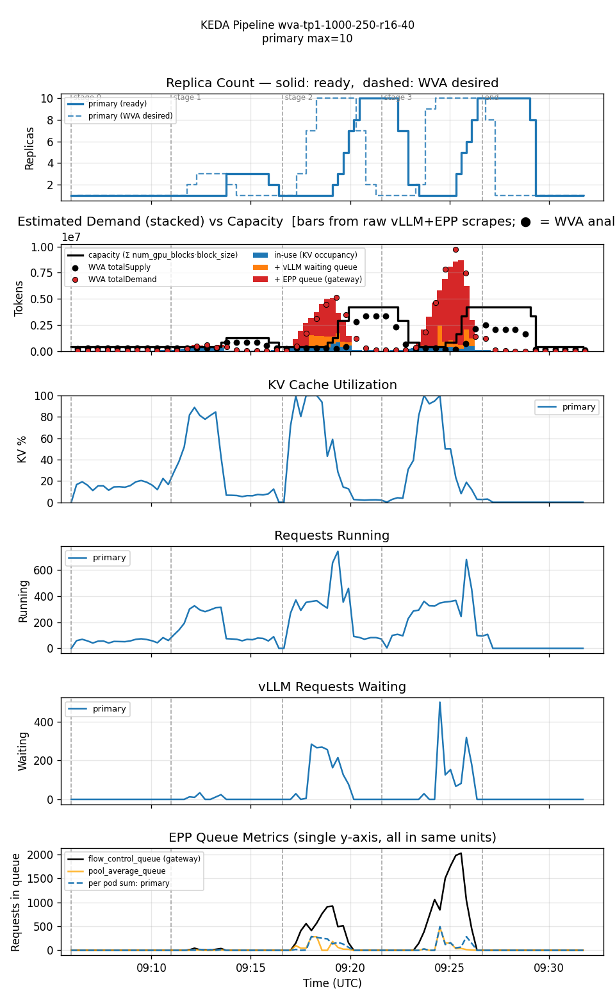
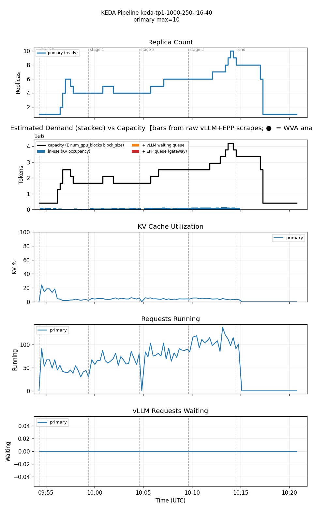

<!--
Table formatting rules for this doc (keep alignment readable in the raw editor):
  1. Every cell has exactly one space of padding inside the pipes (`| cell |`).
  2. Within a table, every row uses the SAME column widths. Widen a column to
     fit its widest cell — don't leave short cells un-padded.
  3. Text columns are left-aligned; numeric columns are right-aligned.
  4. The separator row uses dashes only, with a length matching the column width.
  5. Do not vary column widths between the header, separator, and data rows.
  Regenerate all tables via `hack/format-tables.py` if adding/removing rows.
-->

# Single-variant WVA (Sat-2, multiplier=2, scaleUpThreshold=0.75) vs KEDA-EPP — 1000/250 tokens, rates 16/24/32/40

Date: 2026-07-28
Namespace: `biran` (pokprod001)
Model: `unsloth/Meta-Llama-3.1-8B-Instruct`
Harness: inference-perf v0.7.0

Same 1000/250-token workload as [`comparison-single-variant-1000x250-20260728`](../comparison-single-variant-1000x250-20260728/comparison.md) and [`comparison-1000x250-r10x16-20260728`](../comparison-1000x250-r10x16-20260728/comparison.md), pushed dramatically higher (rates 16 → 24 → 32 → 40, more than double the previous ceiling of 16). This is the first workload/rate combination in the series where WVA genuinely needs to scale — and where that need reveals a real reliability trade-off rather than a one-sided win for either system.

## Setup

Identical to both companion docs: single TP=1 decode deployment (1 GPU/pod), both legs min=1/max=10. WVA: `eppQueueDemandMultiplier=2.0`, `scaleUpThreshold=0.75`. KEDA-EPP: `scaledobject-t50.yaml` (queue threshold=50/pod avg, running-requests threshold=16/pod avg — note this deliberately loosens the queue threshold from the well-lit-path default of 1/pod (sourced from upstream llm-d PR #1981, "convert EPP autoscaling guide to KEDA"), to give a comparison closer to WVA's own GPU budget rather than a strict apples-to-apples well-lit-path baseline).

**Workload** (`prefill_heavy_1000_250_16_24_32_40`, Poisson arrival): input ≈1000 tokens, output ≈250 tokens. 4 stages × 5 min at rate 16, 24, 32, 40. 33600 requests total.

Both runs confirmed clean: zero `FailedScheduling` events during either run's window, no OOMKilled pods, `oc whoami` verified valid throughout, harness completed normally on both legs.

## Results

| metric                       | WVA (mult=2, util=0.75) | KEDA-EPP |
|------------------------------|-------------------------|----------|
| requests                     |                   33600 |    33600 |
| errors                       |                     252 |       30 |
| error rate                   |                   0.75% |    0.09% |
| avg replicas                 |                    3.37 |     4.56 |
| max replicas                 |                      10 |       10 |
| cost (avg replicas × GPU/hr) |                    3.37 |     4.56 |
| avg KV cache utilization     |                   11.6% |     3.4% |
| avg EPP queue depth          |                    20.3 |      0.0 |
| avg pod startup (s)          |                      90 |       90 |
| TTFT p50 (ms)                |                     170 |       60 |
| TTFT p95 (ms)                |                  44,860 |      150 |
| TTFT p99 (ms)                |                  53,270 |      300 |
| Request latency p50 (ms)     |                   6,470 |    2,690 |
| Request latency p95 (ms)     |                  54,120 |    3,660 |
| Request latency p99 (ms)     |                  62,610 |    4,530 |

Per-stage TTFT and error breakdown:

**WVA (mult=2, util=0.75)**

| stage (rate) | p50    | p95    | p99    | errors |
|--------------|--------|--------|--------|--------|
| 0 (16)       | 0.07s  | 0.13s  | 0.19s  |      0 |
| 1 (24)       | 0.10s  | 2.60s  | 3.09s  |     28 |
| 2 (32)       | 8.48s  | 35.93s | 36.48s |      4 |
| 3 (40)       | 11.10s | 50.80s | 55.64s |    220 |

**KEDA-EPP**

| stage (rate) | p50   | p95   | p99   | errors |
|--------------|-------|-------|-------|--------|
| 0 (16)       | 0.06s | 0.12s | 0.41s |     10 |
| 1 (24)       | 0.06s | 0.11s | 0.20s |      0 |
| 2 (32)       | 0.06s | 0.14s | 0.29s |      0 |
| 3 (40)       | 0.07s | 0.18s | 0.30s |     20 |

Reproducing:

| run      | results dir                                                             |
|----------|-------------------------------------------------------------------------|
| WVA      | `biran-20260728-120456-486/results/inference-perf-1785229544-024zkh_1/` |
| KEDA-EPP | `biran-20260728-125329-062/results/inference-perf-1785232455-pk49gv_1/` |

## Graphs

### WVA — two full overshoot-and-correct cycles, KV utilization hits 100% twice

Stage 0 (rate=16) stays completely flat at 1 replica, matching every prior 1000/250 result exactly. Stage 1 (rate=24) produces a small blip (1→2→3, self-corrects). Stages 2 and 3 (rates 32 and 40) each produce a full overshoot cycle to the max (10 replicas) — KV cache utilization spikes to 100% both times, the EPP flow-control queue peaks at ~950 then ~2000, and `vLLM requests waiting` spikes above 500 during the second cycle. The 220 errors in stage 3 dominate the run's total — this is the same reaction-lag mechanism documented on the heavier-token workloads, just triggered here by raw throughput crossing a real capacity threshold for the first time in this token-size series.

### KEDA-EPP — smooth, monotonic-ish tracking, zero backlog ever forms

Replica count climbs in a mostly-monotonic staircase (1→2→4→6→5→4→4→5→6→7→9→10→8→1) that tracks the rate steps closely. KV cache utilization never exceeds ~25%, and `vLLM requests waiting` stays at exactly 0 for the entire run — no backlog ever forms, because KEDA-EPP's concurrency-based trigger reacts continuously rather than waiting for a threshold to be crossed. The 30 errors are small and scattered (10 in stage 0, 20 in stage 3), not clustered around a scaling event the way WVA's are.

## Reading these numbers

**This is the first genuine two-sided trade-off in the 1000/250 series.** Every lighter-rate leg (4-10, 10-16) showed WVA matching or beating KEDA-EPP on both cost and reliability — there was no real decision to make. Here, at rates finally high enough to produce genuine GPU pressure, the trade-off flips to something real: WVA is 26% cheaper (3.37 vs 4.56 avg replicas) but has 8× the error rate (0.75% vs 0.09%) and a TTFT p99 nearly 200× worse (53.3s vs 0.3s). KEDA-EPP's faster, continuous reaction avoids ever letting a backlog form; WVA's threshold-gated reaction lets one form twice, at real cost to both latency and reliability.

**This confirms the mechanism from the 2800/700 and 4000/1000 companion docs, but at a higher rate ceiling than tested before.** WVA's overshoot-and-correct pattern isn't unique to large tokens — it reproduces on small, cheap tokens once the raw rate is high enough (here, roughly the rate=24-32 range) to make per-replica utilization cross the 0.75 threshold. The trigger is aggregate demand pressure, not any particular token size.

**Which system "wins" now depends on what you're optimizing for, not on a one-sided workload mismatch.** At the workload intensities in the companion docs, WVA had no downside — it was simply the correct choice. Here, the cost savings are real but come with a measurable reliability cost, and the answer depends on whether an 8× worse error rate and 40+ second TTFT tail at the peak stage are acceptable for a 26% cost reduction.

## Honest conclusions

1. **WVA's reaction-lag mechanism generalizes to high-throughput, low-token-cost workloads**, not just large-token ones — the trigger is aggregate demand crossing the utilization threshold, regardless of whether that demand comes from big tokens or high concurrency.
2. **This is the first workload in the 1000/250 series where KEDA-EPP's aggressive default policy is unambiguously the safer choice** — its faster reaction avoids the backlog entirely, at a real but modest (26%) cost premium.
3. **The cost/reliability trade-off is now symmetric with the findings in the 2800/700 and 4000/1000 companion docs**: WVA's advantage shrinks or reverses as a workload's demand pressure increases, whether driven by token size or raw rate. The crossover point for this specific model/hardware/config combination sits somewhere between rate=16 (still flat, no pressure) and rate=24 (first real pressure).
4. **Both runs were clean on the first attempt** — no cluster GPU contention, no OOM, no auth issues during either benchmark run itself, continuing the run of clean single-attempt executions once the standard pre-flight checks (controller restart, GPU headroom, config verification) became routine.
