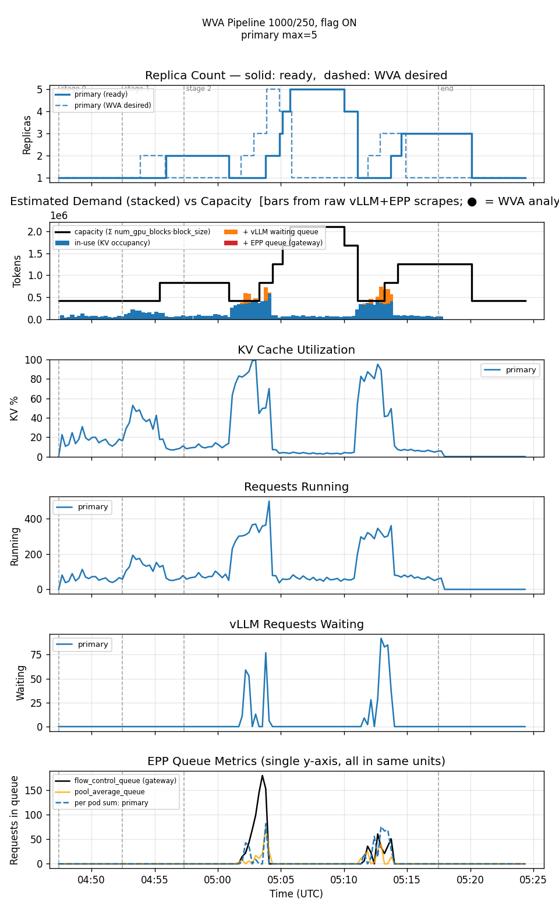
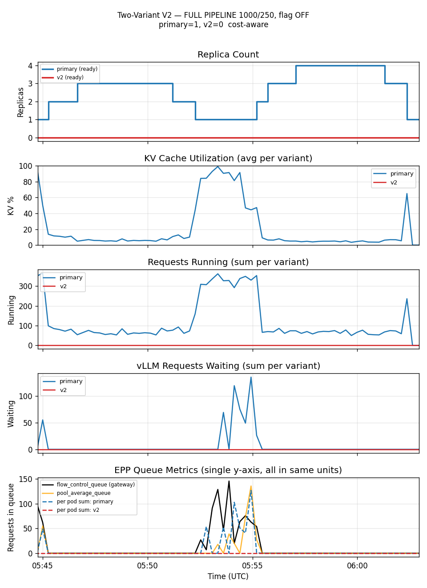
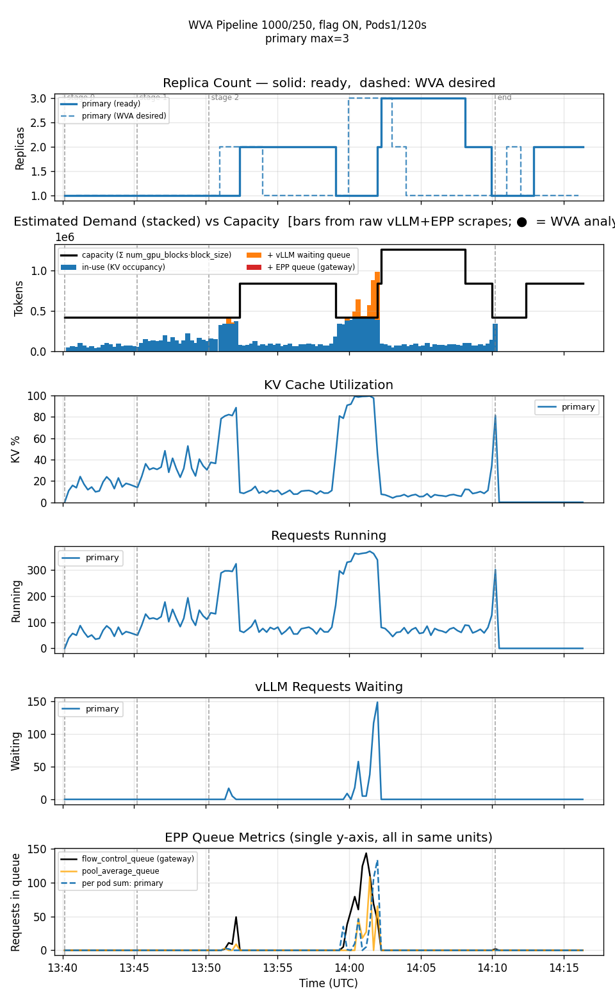
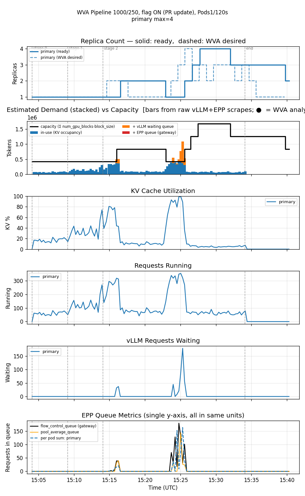
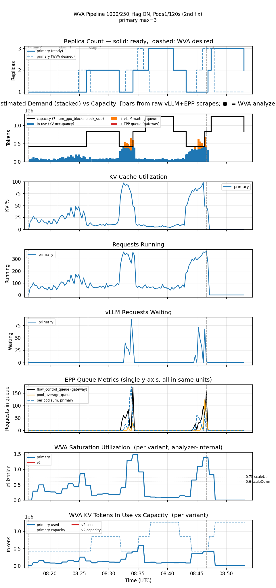
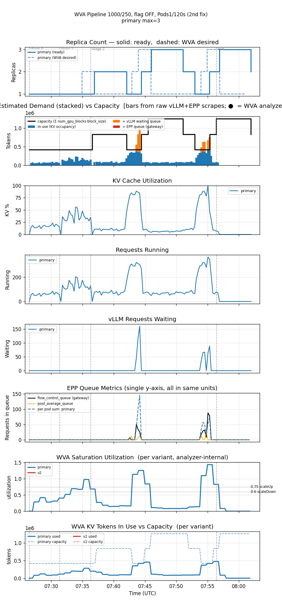

<!--
Table formatting rules for this doc (keep alignment readable in the raw editor):
  1. Every cell has exactly one space of padding inside the pipes (`| cell |`).
  2. Within a table, every row uses the SAME column widths. Widen a column to
     fit its widest cell — don't leave short cells un-padded.
  3. Text columns are left-aligned; numeric columns are right-aligned.
  4. The separator row uses dashes only, with a length matching the column width.
  5. Do not vary column widths between the header, separator, and data rows.
-->

# Rate-anchored k2 (PR #1501) — flag ON vs OFF, sustained 1000/250 prefill-heavy

Date: 2026-07-31
Namespace: `biran` (pokprod001)
Model: `unsloth/Meta-Llama-3.1-8B-Instruct`
Harness: inference-perf v0.7.0
Branch: `validate/rate-anchored-k2`

## Why this doc exists

[PR #1501](https://github.com/llm-d/llm-d-workload-variant-autoscaler/pull/1501) (`feat/rate-anchored-k2`) adds a second, rate-anchored estimator for the V2 saturation analyzer's compute-bound capacity term (`k2`), behind an internal switch (`EnableRateAnchoredK2`). Its own motivation cites this repo's [`comparison-1000x250-16x20x24ext20-20260728`](../comparison-1000x250-16x20x24ext20-20260728/comparison.md) finding: WVA cycling replicas at 16.2% average KV utilization, because the existing `k2` estimator measures a KV **stock** while the real constraint on a prefill-heavy workload is a **rate**. Full problem/approach writeup: [`docs/plans/engine/rate-anchored-k2.md`](../docs/plans/engine/rate-anchored-k2.md) (on the PR branch).

This doc validates the flag against the same sustained 1000/250 workload that motivated the PR: flag ON vs flag OFF at the shipped-default KEDA `scaleDown` policy, plus four legs pairing flag ON/OFF with the metered `Pods 1/120s` policy that a prior, unrelated sweep ([`comparison-1000x250-16x20x24ext20-20260728`](../comparison-1000x250-16x20x24ext20-20260728/comparison.md)) found to be the single best-performing WVA configuration on this workload — across three successive PR revisions as it was updated mid-validation. Same cluster state throughout; controller restarted between legs to flush in-memory `k2` history.

## Setup

Single TP=1 decode deployment (1 GPU/pod), min=1/max=10, `scaleUpThreshold=0.75`, `scaleDownBoundary=0.60` (live-patched into the saturation ConfigMap) for all six legs. ScaledObject `scaleUp` Percent100/15s (window 0s) throughout; `scaleDown` is Percent100/15s (window 300s, shipped default) for the ON/OFF legs and `Pods 1/120s` (window 300s) for the remaining four legs.

Flag toggled via two separately built images (`EnableRateAnchoredK2` is a Go build-time const, not runtime-toggleable): `ghcr.io/biranofer/llm-d-workload-variant-autoscaler:rate-anchored-k2-on` and `...-off`, rebuilt across three PR revisions as it was updated mid-validation:
- Legs 1-3: commit `46c22692` (PR branch merged onto fresh `upstream/main`).
- Leg 4 (`ON, Pods1/120s (PR update)`): `-on` rebuilt after merging 5 more commits (`89d152e2`, commit `38db3553`).
- Legs 5-6 (`v3`): both `-on` and `-off` rebuilt after merging 2 more commits (`cc42e820`, commit `e63e8cb9`) — the first same-day ON/OFF pair at this KEDA policy on the PR's latest revision.

Legs 5-6 also benefit from two infra fixes made mid-validation, absent for legs 1-4: the decode Deployment now has `nodeSelector: {nvidia.com/gpu.product: NVIDIA-H100-80GB-HBM3}` so WVA resolves the accelerator and emits `wva_saturation_utilization`/KV-token gauges (previously silently withheld — see [[project_pr1501_rate_anchored_k2_validation]]), and the `ServiceMonitor`'s TLS `serverName` bug is fixed so those metrics are actually scraped. Legs 1-4 lack the two new bottom graph panels as a result.

**Workload** (`prefill_heavy_1000_250_16_20_24x20`, Poisson arrival): input 1000±50 tokens, output 250±25 tokens. 3 stages: 5 min @ rate 16, 5 min @ rate 20, 20 min @ rate 24. 39,600 requests total. Both runs confirmed clean (harness reported zero crashes; the error counts below are HTTP-level request failures, not harness failures).

## Results

| metric                        | ON, Percent100 | OFF, Percent100 | ON, Pods1/120s | ON, Pods1/120s (PR update) | ON, Pods1/120s (v3) | OFF, Pods1/120s (v3) |
|--------------------------------|---------------:|-----------------:|----------------:|-----------------------------:|----------------------:|-----------------------:|
| requests                       |         39,600 |            39,600 |          39,600 |                        39,600 |                 39,600 |                  39,600 |
| errors                         |             67 |                132 |             123 |                             1 |                    102 |                      93 |
| error rate                     |          0.17% |              0.33% |           0.31% |                        0.003% |                  0.26% |                   0.23% |
| avg replicas                   |           2.09 |               1.82 |            1.67 |                          2.07 |                   1.83 |                    1.86 |
| max replicas                   |              5 |                  4 |               3 |                             4 |                      3 |                       3 |
| cost (avg replicas × GPU/hr)   |           2.09 |               1.82 |            1.67 |                          2.07 |                   1.83 |                    1.86 |
| avg KV cache utilization       |          12.9% |              15.0% |           15.8% |                         12.2% |                  15.4% |                   14.2% |
| avg EPP queue depth            |           2.19 |               3.54 |            2.04 |                          2.64 |                   1.90 |                    0.56 |
| avg pod startup (s)            |             88 |                 86 |              95 |                            94 |                     73 |                      80 |
| TTFT mean (s)                  |           0.74 |               0.79 |            0.61 |                          0.61 |                   0.79 |                    0.62 |
| TTFT p50 (s)                   |           0.08 |               0.08 |            0.08 |                          0.08 |                   0.08 |                    0.08 |
| TTFT p90 (s)                   |           3.24 |               3.70 |            1.44 |                          1.44 |                   3.54 |                    2.52 |
| TTFT p99 (s)                   |           7.58 |               7.40 |            8.36 |                          8.65 |                   7.51 |                    7.09 |
| Request latency mean (s)       |           6.27 |               6.34 |            5.87 |                          5.76 |                   6.48 |                    5.94 |
| Request latency p99 (s)        |          21.96 |              22.51 |           23.34 |                         23.92 |                  22.15 |                   21.61 |
| ITL mean (s)                   |          0.021 |              0.021 |           0.020 |                         0.020 |                  0.022 |                   0.021 |

Reproducing:

| run                         | results dir                                                              |
|-----------------------------|-----------------------------------------------------------------------------|
| ON, Percent100              | `biran-20260731-074630-265/results/inference-perf-1785473235-ils2ow_1/`     |
| OFF, Percent100             | `biran-20260731-083127-585/results/inference-perf-1785475931-dc4q88_1/`     |
| ON, Pods1/120s              | `biran-20260731-163922-172/results/inference-perf-1785505207-0yuu3c_1/`     |
| ON, Pods1/120s (PR update)  | `biran-20260731-180318-128/results/inference-perf-1785510244-zimcvt_1/`     |
| ON, Pods1/120s (v3)         | `biran-20260801-111534-617/results/inference-perf-1785572180-drw2e6_1/`     |
| OFF, Pods1/120s (v3)        | `biran-20260801-102543-022/results/inference-perf-1785569188-wdlvbz_1/`     |

For reference, the historical (pre-PR, effectively flag-off) `Pods1/120s` leg from the prior sweep: 78 errors (0.20%), 1.70 avg replicas, max 3, TTFT p99 4.30s.

## Replica timeline (decode, collapsed to transitions)

**Flag ON** — 11 transitions over ~33 min:

```
1 → 2 → 1 → 2 → 3 → 4 → 5 → 4 → 1 → 2 → 3 → 1
04:47  :55  05:00 :03  :04  :05  :05  :10  :11  :13  :14  :20
```

One mid-run collapse-to-1 (peak 5 at 05:05:42 → 1 by 05:11:04), recovers to 3, then scales down to 1 at 05:20:06 — lining up with the load profile ending (~30 min after start) rather than a second spurious collapse.

**Flag OFF** — 9 transitions over ~30 min:

```
1 → 2 → 3 → 2 → 1 → 2 → 3 → 4 → 3 → 1
05:32  :45  :46  :51  :52  :55  :55  :57  06:01 :02
```

Same shape: one mid-run collapse-to-1 (peak 3 at 05:46:39 → 1 by 05:52:16), recovers to 4, then scales down to 1 at 06:02:22, again aligned with load-profile end.

**Flag ON, Pods1/120s** — 7 transitions over ~33 min, ground-truth `ready_replicas`:

```
1 → 2 → 1 → 2 → 3 → 2 → 1 → 2
13:40  :52  :59  14:02 :02  :08  :10  :13
```

Every descent removes exactly one pod at a time, spaced ~110-120s apart (2→1 at 13:59:04; 3→2 at 14:08:06, then 2→1 at 14:09:57, 111s later) — the metering is real, but since peaks never exceed 3 here, a 2-step metered drain looks almost as fast as a cliff would. The meaningful difference from the Percent100 legs is the **peak size**: max 3 vs 5 (ON) or 4 (OFF), consistent with the historical finding that this policy is the cheapest lever tested on this workload — it just never lets the controller commit to as large a replica count in the first place.

**Flag ON, Pods1/120s, PR update** — 7 transitions over ~36 min, ground-truth `ready_replicas`:

```
1 → 2 → 1 → 2 → 3 → 4 → 3 → 2
15:04  :16  :22  :25  :26  :27  :32  :39
```

Never drops back to 1 after the initial ramp — every descent lands at 2 or higher for the rest of the run. This is the only leg of the four that doesn't have a mid-run collapse-to-1 at all.

**Flag ON, Pods1/120s (v3)** — 9 transitions over ~37 min, ground-truth `ready_replicas`:

```
1 → 2 → 1 → 2 → 3 → 2 → 1 → 2 → 3 → 2
08:16  :26  :31  :34  :36  :41  :43  :46  :47  :53
```

Back to the earlier pattern: two full collapses to 1 (08:31, 08:43) rather than the PR-update leg's "never drops below 2." Same code as leg 4 above plus 2 more commits (`cc42e820`) — the extra fix doesn't preserve the "hold above 1" behavior on this particular run.

**Flag OFF, Pods1/120s (v3)** — 9 transitions over ~35 min, ground-truth `ready_replicas`:

```
1 → 2 → 1 → 2 → 3 → 2 → 1 → 2 → 3 → 2
07:26  :36  :42  :44  :46  :51  :52  :55  :56  08:01
```

Same shape as its ON counterpart above, offset by a few minutes — both legs of this same-day pair collapse to 1 twice.

## Graphs

Both plots are single-variant runs (no secondary variant deployed) — the flat red "v2" lines in
each panel are inactive/always-zero, not a data gap. The flag-OFF run's `wva_target_timeseries.json`
(WVA-desired overlay) and `capacity_demand_estimate.json` (demand-vs-capacity panel) weren't
generated at the time — `dump_wva_target_timeseries.py` reads live via `kubectl logs`, and by the
time it would have run the controller had already been restarted for the next leg, past the
window. Regenerated both after the fact: the demand-estimate script works from the run's saved
raw vLLM/EPP scrapes (no controller-log dependency), and the WVA-desired series was rebuilt by
replaying the same "Applied saturation decision" pattern against the full controller log already
saved in `results/.../wva-controller.log`.

Dashed gray vertical lines mark the load-profile's stage transitions (rate 16→20→24, measured
elapsed seconds per stage, not nominal) and the run's end.

### Flag ON — ramps to 5, one sharp collapse-to-1, recovers to 3



Replica count climbs `1→2→3→4→5` as KV utilization and requests-running rise through the rate=20
and rate=24 stages, peaks at 5 while KV cache hits ~100%, then collapses `5→4→1` within about a
minute once the queue drains. Recovers to 3 for the remainder of the sustained stage. The
estimated-demand panel shows two clear bars-exceed-capacity spikes (the two KV-utilization peaks)
where vLLM waiting queue and EPP flow-control queue both spike into the hundreds before draining.

### Flag OFF — ramps to 4, one sharp collapse-to-1, recovers to 4



Same shape: `1→2→3` early, drops to 1 as load between stages eases, then climbs `2→3→4` as KV
utilization saturates again (~100%) with vLLM waiting queue peaking near 140 and EPP flow-control
queue peaking near 150 — both higher peaks than the ON run's corresponding spike. Holds at 3-4
through the rest of the sustained stage before the end-of-run drain to 1.

Worth noting: the WVA-desired dashed line visibly **leads** the ready-replica solid line at every
step here (e.g. desired jumps to 3 at ~05:44 before ready follows at ~05:46; desired jumps to 4 at
~05:55 before ready catches up seconds later) — that lag is pod-startup time, not a control-loop
delay, and it's present in both legs.

### Flag ON, Pods1/120s — smallest peak of the three legs, but a bigger error count than expected



Replica count only reaches 3 (vs 5 and 4 for the Percent100 legs), and the estimated-demand panel
shows the same two saturation spikes as the other legs. vLLM waiting-queue peaks highest of the
three legs here (149 requests vs 92 for ON/Percent100 and 135 for OFF/Percent100) — consistent
with fewer replicas absorbing the same demand — but EPP flow-control queue peaks *lowest* of the
three (143 vs 180 for ON/Percent100 and 146 for OFF/Percent100), so the smaller replica count
doesn't uniformly worsen every queue signal.

### Flag ON, Pods1/120s, PR update — same queue pressure, 1 error instead of 123



Replica count ramps `1→2→3→4` through the rate=24 stage and never fully drains — it settles at 2
by the end rather than collapsing to 1. The demand spikes here are, if anything, the **largest**
of all four legs (vLLM waiting queue peaks at 179 requests, EPP flow-control queue at 179 — both
the highest values in this doc), yet the run finished with a single HTTP-level error. Same
workload, same KEDA policy, same thresholds as the "ON, Pods1/120s" leg above — the only variable
that changed is the 5 additional PR commits.

### Flag ON, Pods1/120s (v3) — two collapses again, plus the new analyzer-internal panels



First run with working `wva_saturation_utilization`/KV-token panels (bottom two). The utilization
line tracks the replica-count story exactly: spikes above the 0.75 scaleUp line at each of the two
demand bursts, dips below 0.60 scaleDown in between — consistent with the two full collapses to 1
seen in the replica timeline. Peak utilization reaches ~1.4, meaning demand briefly outstrips the
analyzer's own capacity estimate by 40%.

### Flag OFF, Pods1/120s (v3) — same shape, first same-day OFF pairing at this policy



The first flag-OFF run at this KEDA policy since the original leg 1b (which used Percent100).
Utilization and replica-count shapes closely mirror the ON leg above — both collapse to 1 twice,
both peak around utilization 1.3-1.4. Slightly fewer errors than ON (93 vs 102) on this particular
pair, reversing the direction seen at Percent100 (where ON had fewer errors).

## Reading these numbers

**Flag ON halves the error rate** (67 vs 132 failed requests) and **lowers EPP queue depth** substantially (2.19 vs 3.54 avg) — consistent with the rate-anchored estimator tracking real arrival throughput rather than an inflated KV-stock history. Request latency p99 is marginally better under ON (21.96s vs 22.51s); TTFT p50 is identical (0.08s either way), p90 favors ON (3.24s vs 3.70s), p99 slightly favors OFF (7.58s vs 7.40s) — mean/p90 lean ON, p99 is noise-level either way.

**The dramatic difference the plan doc predicted did not show up in replica-count stability.** [`docs/plans/engine/rate-anchored-k2.md`](../docs/plans/engine/rate-anchored-k2.md)'s validation section expected the "two overshoot-correct cycles" seen in the original comparison run to *disappear* under flag ON. Instead, both Percent100 legs here show the **same shape**: one mid-run ramp-to-peak → collapse-to-1 → partial recovery cycle, comparable in timing and amplitude. The oscillation pattern itself doesn't visibly improve at this specific rate profile — the win shows up in error rate and queue depth, not in replica-count behavior.

**Pairing flag ON with the historically best KEDA policy (`Pods1/120s`) initially looked like a regression, but the PR's own follow-up commits fixed it.** The prior sweep found `Pods1/120s` (flag effectively off, since the PR didn't exist yet) to be the single best-performing WVA leg on this workload: 78 errors (0.20%), TTFT p99 4.30s, 1.70 avg replicas. The first flag-ON leg at that KEDA policy regressed hard: 123 errors (0.31%), TTFT p99 8.36s — nearly identical cost, but ~58% more errors and ~94% worse TTFT p99, the opposite of what pairing two "good" levers should produce. After merging 5 additional PR commits (`f4856bb1..89d152e2`, all further `saturation-v2` fixes) and re-running the *identical* config: **1 error** (down from 123), at a similar average replica count (2.07 vs 1.67) and against demand spikes that were, if anything, the largest of any leg tested (vLLM waiting queue and EPP flow-control queue both peaked at 179, the highest values in this doc). TTFT p99 is still worse than the historical baseline (8.65s vs 4.30s) and didn't improve from the pre-update leg — but the error-count fix is unambiguous and large, not noise-level.

## Honest conclusions

1. **Flag ON is a real, if modest, improvement over flag OFF at the shipped-default KEDA policy**: half the error rate, lower EPP queue depth, at the cost of slightly higher average replica count (2.09 vs 1.82) — i.e. it trades a little more compute for meaningfully fewer failed requests.
2. **The PR's original revision paired badly with the historically best-tuned KEDA policy; the updated revision fixes the reliability regression, but not the tail latency.** At `Pods1/120s`, the original flag-ON leg had far more errors than the pre-PR baseline at the same policy (123 vs 78) despite matching its cost almost exactly. The updated PR revision (5 more commits) cut that to 1 error at the same config, under an even larger demand spike — a dramatic, unambiguous fix. TTFT p99, however, stayed elevated (~8.5s) versus the historical baseline's 4.30s in *both* PR revisions, so whatever the update fixed for reliability didn't touch tail latency.
3. **Confounds remain for the tail-latency comparison against history**: `GLOBAL_OPT_INTERVAL` was fixed between the historical sweep and today (30s→15s optimize loop, [[project_pr1487_optimize_interval]]). The error-count improvement (123→1 at the PR-update leg) is too large to be explained by that confound alone, but the persistent TTFT p99 gap against history could still be partly attributable to it rather than to the flag.
4. **A same-day ON/OFF pair at `Pods1/120s` on the PR's latest revision (v3, 2 more commits) does *not* reproduce the dramatic PR-update leg's 1-error result** — both legs regressed back to double digits (102 ON, 93 OFF), with OFF actually *lower* than ON this time, reversing the direction seen at Percent100. Both legs show the same replica-timeline shape (two full collapses to 1), unlike the single PR-update leg which never dropped below 2. Combined with the single-run-per-leg caveat below, the 1-error result looks more like it was a favorable roll for that specific run than a stable property of that PR revision — the v3 pair, run back-to-back same-day, shows both flag settings behaving similarly to each other and to the pre-PR-update baseline.
5. **v3 is also the first leg with working `wva_saturation_utilization`/KV-token panels** (via a Thanos-based dumper, after fixing two infra bugs found mid-validation: a `nodeSelector`-driven accelerator-resolution gap, and a `ServiceMonitor` TLS `serverName` bug — see [[project_pr1501_rate_anchored_k2_validation]] and [[feedback_servicemonitor_tls_servername_bug]]). Confirms the analyzer's own utilization signal tracks the replica-count story exactly, which is a useful sanity check independent of the ON/OFF question.
6. **Every leg here is one run (no repeat), back-to-back on the same cluster with no seed control on the Poisson load** — the smaller gaps should be read as directional, not conclusive. The two large findings that still stand: ON/OFF error-rate gap at Percent100, and the single dramatic 123→1 fix at the PR-update revision (now looking less generalizable given the v3 pair's regression).
7. **Next step**: leg 2 (decode-heavy 100/1000, flag ON) and leg 3 (symmetric 300/300 Poisson, flag ON regression control — must stay flat at 1 replica with zero errors, since a more conservative capacity estimate could turn "correctly holds at one replica" into spurious scale-up). Not started yet; results should be reviewed leg-by-leg, not auto-chained. Use the latest (v3) image.
