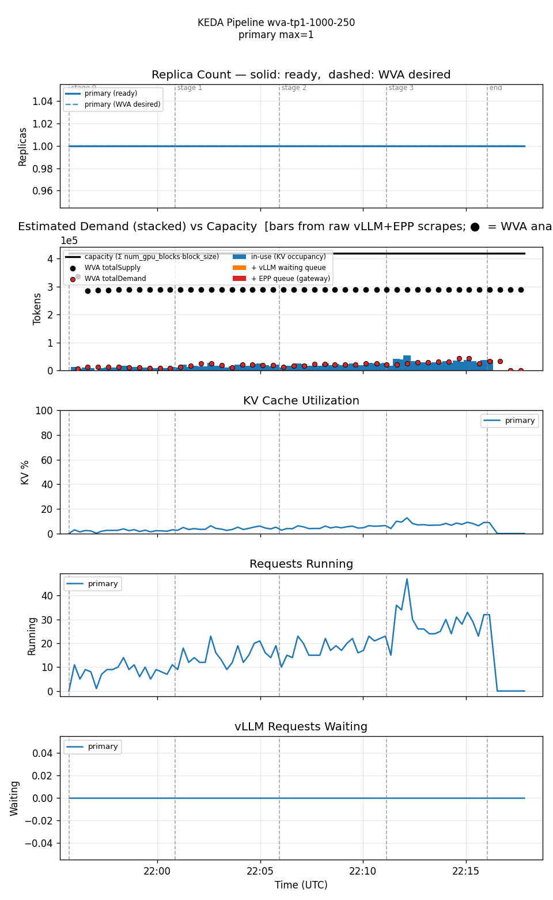
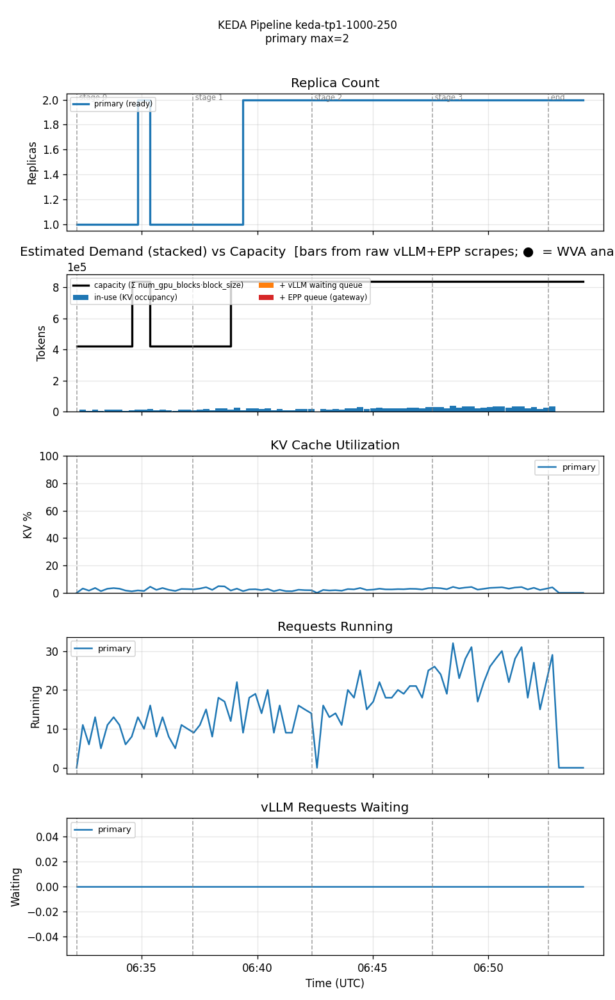

<!--
Table formatting rules for this doc (keep alignment readable in the raw editor):
  1. Every cell has exactly one space of padding inside the pipes (`| cell |`).
  2. Within a table, every row uses the SAME column widths. Widen a column to
     fit its widest cell — don't leave short cells un-padded.
  3. Text columns are left-aligned; numeric columns are right-aligned.
  4. The separator row uses dashes only, with a length matching the column width.
  5. Do not vary column widths between the header, separator, and data rows.
  Regenerate all tables via `hack/format-tables.py` if adding/removing rows.
-->

# Single-variant WVA (Sat-2, multiplier=2, scaleUpThreshold=0.75) vs KEDA-EPP — 1000/250 stepped-ramp

Date: 2026-07-28
Namespace: `biran` (pokprod001)
Model: `unsloth/Meta-Llama-3.1-8B-Instruct`
Harness: inference-perf v0.7.0

The lightest workload tested in this series — lighter than the 2000/500 leg in [`comparison-single-variant-stepped-20260727`](../comparison-single-variant-stepped-20260727/comparison.md) and the 2800/700 leg in [`comparison-single-variant-2800x700-20260728`](../comparison-single-variant-2800x700-20260728/comparison.md). 1000 input / 250 output tokens, rate steps 4 → 6 → 8 → 10 (same rate range as the 2800/700 doc). This one surfaces a genuinely different, and more clear-cut, finding than either companion doc.

## Setup

Single TP=1 decode deployment (1 GPU/pod), both legs min=1/max=10. Same WVA config as the 2800/700 companion doc: `eppQueueDemandMultiplier=2.0`, `scaleUpThreshold=0.75`. Same KEDA-EPP config: `scaledobject-t50.yaml` (queue threshold=50/pod avg, running-requests threshold=16/pod avg).

**Workload** (`prefill_heavy_1000_250_4_6_8_10`, Poisson arrival): input ≈1000 tokens, output ≈250 tokens. 4 stages × 5 min at rate 4, 6, 8, 10. 8400 requests total.

Both runs confirmed clean: zero `FailedScheduling` events during either run's window, no OOMKilled pods, harness completed normally on both legs. (One `oc`-login token expiry occurred during the KEDA-EPP standup — an already-documented cluster quirk, self-recovered once re-authenticated; did not affect either benchmark run itself.)

## Results

| metric                       | WVA (mult=2, util=0.75) | KEDA-EPP |
|------------------------------|-------------------------|----------|
| requests                     |                    8400 |     8400 |
| errors                       |                       1 |        0 |
| error rate                   |                   0.01% |    0.00% |
| avg replicas                 |                    1.00 |     1.70 |
| max replicas                 |                       1 |        2 |
| cost (avg replicas × GPU/hr) |                    1.00 |     1.70 |
| avg KV cache utilization     |                    4.5% |     2.5% |
| avg EPP queue depth          |                     0.0 |      0.0 |
| avg pod startup (s)          |                      65 |       95 |
| TTFT p50 (ms)                |                      50 |       50 |
| TTFT p95 (ms)                |                      80 |       70 |
| TTFT p99 (ms)                |                     100 |       90 |
| Request latency p50 (ms)     |                   2,520 |    2,490 |
| Request latency p95 (ms)     |                   3,040 |    2,920 |
| Request latency p99 (ms)     |                   3,270 |    3,060 |

Per-stage TTFT and error breakdown:

**WVA (mult=2, util=0.75)**

| stage (rate) | p50   | p95   | p99   | errors |
|--------------|-------|-------|-------|--------|
| 0 (4)        | 0.04s | 0.06s | 0.08s |      0 |
| 1 (6)        | 0.05s | 0.07s | 0.08s |      0 |
| 2 (8)        | 0.05s | 0.07s | 0.10s |      0 |
| 3 (10)       | 0.05s | 0.09s | 0.11s |      1 |

**KEDA-EPP**

| stage (rate) | p50   | p95   | p99   | errors |
|--------------|-------|-------|-------|--------|
| 0 (4)        | 0.05s | 0.07s | 0.08s |      0 |
| 1 (6)        | 0.05s | 0.07s | 0.09s |      0 |
| 2 (8)        | 0.05s | 0.07s | 0.09s |      0 |
| 3 (10)       | 0.05s | 0.08s | 0.10s |      0 |

Reproducing:

| run      | results dir                                                             |
|----------|-------------------------------------------------------------------------|
| WVA      | `biran-20260728-005456-227/results/inference-perf-1785189340-t6i9dv_1/` |
| KEDA-EPP | `biran-20260728-093123-004/results/inference-perf-1785220328-z9dmlo_1/` |

## Graphs

### WVA — never scales past 1 replica

KV cache utilization never rises above single digits for the entire run — WVA correctly recognizes there is no capacity pressure and holds at 1 replica through all four rate steps, including the final rate=10 stage.

### KEDA-EPP — scales to 2 purely on request concurrency, not GPU pressure

KV cache utilization stays just as flat here (2-5%) as in the WVA leg — the GPU is never remotely stressed. But `requests running` climbs steadily from ~10 toward ~30 as the rate steps up, and once the running-requests-per-pod average crosses the fixed threshold of 16, KEDA scales to 2 replicas (with one brief earlier blip to 2 and back) and stays there for the rest of the run. This is a scaling decision driven entirely by request *count*, with no reference to how cheap each request is to actually serve.

## Reading these numbers

**This is the cleanest illustration yet of the structural difference between the two systems' scaling signals.** WVA's Sat-2 model scales on KV/compute *utilization* — a direct measure of GPU pressure — and correctly stays at 1 replica because a 250-token output is cheap enough that even 10 req/s of arrivals never saturates the GPU. KEDA-EPP's `running_requests` trigger scales on raw *concurrency* (simultaneous in-flight requests) against a fixed threshold (16/pod) that has no notion of how expensive each request is. Concurrency here is driven by `rate × latency` (~10 req/s × ~2.5s latency ≈ 25 concurrent requests at the top rate) — enough to cross the threshold and trigger a scale-up that GPU utilization data shows was unnecessary.

**Unlike every other comparison in this series, there is no latency/cost trade-off here — KEDA-EPP is simply more expensive for the same performance.** TTFT and request latency are statistically indistinguishable between the two legs (both trivially fast; KEDA-EPP is even marginally *better* on TTFT p95/p99 despite the same real capacity being available on both). WVA gets identical performance at ~41% lower cost (1.00 vs 1.70 avg replicas) purely because it measures the right signal for this workload shape.

**This is the flip side of the story told in the 2800/700 and 4000/1000 companion docs.** There, WVA's utilization-based reaction lag cost it real tail latency during sudden load steps — a genuine trade-off against KEDA-EPP's faster, concurrency-based reaction. Here, that same concurrency-based reaction has no upside at all, because concurrency was never actually a proxy for capacity pressure in the first place. Which system "wins" depends entirely on whether request concurrency and GPU utilization move together for a given workload — for cheap, short-output requests they don't, and that's exactly when WVA's model shows its advantage most cleanly.

## Honest conclusions

1. **KEDA-EPP's `running_requests` trigger threshold (16/pod) is workload-shape-dependent in a way its config can't express.** It scales on concurrency, not on any direct signal of GPU saturation, so a fixed threshold that's reasonable for one workload's request cost can over-trigger on a cheaper workload and (per the companion docs) under-react fast enough on more demanding ones.
2. **WVA's utilization-based model is a better proxy for actual capacity pressure** whenever request cost varies — this run demonstrates a case where it avoids a scale-up that measurably added cost with no performance benefit.
3. **This doesn't contradict the companion docs' finding that WVA's reaction lag causes real tail-latency risk under sudden load steps.** Both things are true: WVA reacts slower to a genuine capacity event (bad on 2800/700 and 4000/1000), but doesn't react to a non-event at all (good here). The two behaviors share the same root cause — WVA gates on utilization crossing a threshold rather than reacting continuously to raw request counts.
4. **Both runs were clean on the first attempt** apart from an `oc`-login token expiry during the KEDA-EPP standup (self-recovered, did not affect either benchmark run) — continuing the streak of clean single-attempt runs once the controller-restart and GPU-headroom checks from earlier docs became standard practice.
