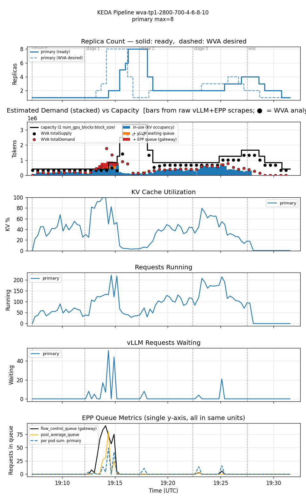
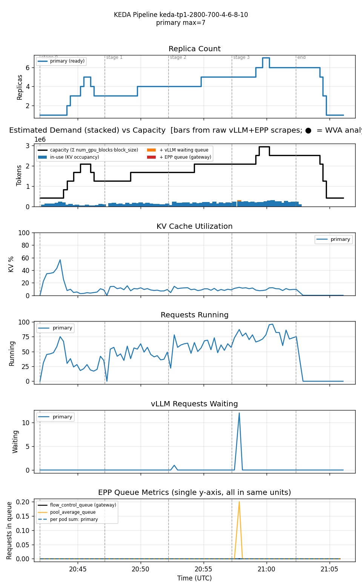

<!--
Table formatting rules for this doc (keep alignment readable in the raw editor):
  1. Every cell has exactly one space of padding inside the pipes (`| cell |`).
  2. Within a table, every row uses the SAME column widths. Widen a column to
     fit its widest cell — don't leave short cells un-padded.
  3. Text columns are left-aligned; numeric columns are right-aligned.
  4. The separator row uses dashes only, with a length matching the column width.
  5. Do not vary column widths between the header, separator, and data rows.
  Regenerate all tables via `hack/format-tables.py` if adding/removing rows.
-->

# Single-variant WVA (Sat-2, multiplier=2, scaleUpThreshold=0.75) vs KEDA-EPP — 2800/700 stepped-ramp

Date: 2026-07-28
Namespace: `biran` (pokprod001)
Model: `unsloth/Meta-Llama-3.1-8B-Instruct`
Harness: inference-perf v0.7.0

A different workload intensity from [`comparison-single-variant-stepped-20260727`](../comparison-single-variant-stepped-20260727/comparison.md): larger tokens (2800 input / 700 output, vs 2000/500 and 4000/1000 tested there) and higher rate stages (4 → 6 → 8 → 10, vs 2 → 4 → 6 → 8) — a deliberate middle intensity between that doc's "barely any pressure" 2000/500 leg and its "heavy pressure" 4000/1000 leg. WVA config also differs from that doc's multiplier=1 leg: this run uses `eppQueueDemandMultiplier=2.0` and a lowered `scaleUpThreshold=0.75` (vs the 0.85 default), to see how a more aggressive scale-up threshold plus the multiplier interact on a workload that actually produces a real (not flat-zero, not extreme) demand signal.

## Setup

Single TP=1 decode deployment (1 GPU/pod), both legs min=1/max=10.

**WVA Sat-2** (`guides/wva-sat2-tp1`)
- `scaleUpThreshold: 0.75` (lowered from the 0.85 default), `scaleDownBoundary: 0.70`, `kvCacheThreshold: 0.80`, `queueLengthThreshold: 5`, `eppQueueDemandMultiplier: 2.0`.
- Controller image: `ghcr.io/biranofer/llm-d-workload-variant-autoscaler:pr1468-epp-multiplier-config`.
- EPP `flowControl` gate active; controller restarted immediately before the run (flushes in-memory k2 history — see [[feedback_restart_controller_before_run]]).

**KEDA-EPP** (`guides/keda-epp-tp1`, `scaledobject-t50.yaml`)
- `sum(inference_extension_flow_control_queue_size)` threshold=50/pod avg, `sum(inference_objective_running_requests)` threshold=16/pod avg. `pollingInterval: 15s`, `cooldownPeriod: 300s`.
- Fresh standup for this leg (teardown of the WVA stack, then `benchmark-standup guides/keda-epp-tp1`) — the two scenarios aren't safely co-resident since WVA's own ScaledObject and the manual `scaledobject-t50.yaml` would otherwise both target the same Deployment.

Both share the same native-HPA behavior: ScaleUp Percent=100/15s stab=0s; ScaleDown Percent=100/15s stab=120s.

**Workload** (`prefill_heavy_2800_700_4_6_8_10`, Poisson arrival): input ≈2800 tokens, output ≈700 tokens. 4 stages × 5 min at rate 4, 6, 8, 10. 8400 requests total.

Both runs confirmed clean: zero `FailedScheduling` events during either run's window, no OOMKilled pods, harness completed normally on both legs.

## Results

| metric                       | WVA (mult=2, util=0.75) | KEDA-EPP |
|------------------------------|-------------------------|----------|
| requests                     |                    8400 |     8400 |
| errors                       |                      52 |       23 |
| error rate                   |                   0.62% |    0.27% |
| avg replicas                 |                    2.43 |     3.98 |
| max replicas                 |                       8 |        7 |
| cost (avg replicas × GPU/hr) |                    2.43 |     3.98 |
| avg KV cache utilization     |                   24.0% |     8.5% |
| avg EPP queue depth          |                     1.9 |      0.0 |
| avg pod startup (s)          |                      80 |       92 |
| TTFT p50 (ms)                |                     150 |      100 |
| TTFT p95 (ms)                |                  10,960 |      270 |
| TTFT p99 (ms)                |                  19,860 |    3,000 |
| Request latency p50 (ms)     |                  13,220 |    7,610 |
| Request latency p95 (ms)     |                  35,360 |   11,470 |
| Request latency p99 (ms)     |                  43,580 |   15,390 |

Per-stage TTFT and error breakdown:

**WVA (mult=2, util=0.75)**

| stage (rate) | p50   | p95    | p99    | errors |
|--------------|-------|--------|--------|--------|
| 0 (4)        | 0.12s | 0.25s  | 0.50s  |      0 |
| 1 (6)        | 1.25s | 19.79s | 22.08s |      0 |
| 2 (8)        | 0.13s | 0.40s  | 3.70s  |     52 |
| 3 (10)       | 0.17s | 1.90s  | 4.10s  |      0 |

**KEDA-EPP**

| stage (rate) | p50   | p95   | p99   | errors |
|--------------|-------|-------|-------|--------|
| 0 (4)        | 0.11s | 0.24s | 1.40s |     13 |
| 1 (6)        | 0.10s | 0.22s | 2.29s |      0 |
| 2 (8)        | 0.10s | 0.27s | 3.00s |      0 |
| 3 (10)       | 0.10s | 0.33s | 3.49s |     10 |

Reproducing:

| run      | results dir                                                             |
|----------|-------------------------------------------------------------------------|
| WVA      | `biran-20260727-220611-732/results/inference-perf-1785179219-lsl8px_1/` |
| KEDA-EPP | `biran-20260727-234107-046/results/inference-perf-1785184912-v0wkim_1/` |

## Graphs

### WVA — overshoot-and-settle at stage 1 (rate=6)

Desired target jumps to 8 almost immediately once stage 1 begins, ready climbs 1→2→5→8 over a few minutes, then flaps back down before settling to 2-4 replicas for the remainder of the run. This is a genuine EPP-queue burst — the flow-control queue peaks around 90 during that window (visible in the EPP Queue Metrics panel), not a flat-zero non-event like the lighter 2000/500 workload in the companion doc. All 52 errors cluster right at the stage-1→2 settling transition, not spread across the run.

### KEDA-EPP — smooth, monotonic-ish ramp following the rate steps

Replica count tracks the rate steps closely (1→3→5→3→4→5→7→6→1) with no overshoot-and-correct cycle — KEDA-EPP's aggressive scaleUp policy keeps pace with demand as it rises rather than reacting to a transient spike. The only blip is a brief one-sample waiting-queue spike (12) right at the stage-2→3 transition. Its 23 errors split between stage 0 (13, likely cold-start related) and stage 3 (10), with zero in the two middle stages.

## Reading these numbers

**This workload sits between the two extremes in the companion doc.** The 2000/500 leg there produced almost no scaling pressure (avg replicas 1.14, errors 0.42%); the 4000/1000 legs produced a severe, sustained pileup (avg replicas 3.41-3.53, errors 1.22-2.03%, TTFT p99 in the 58-74s range). This 2800/700-at-rates-4-10 workload lands in between on every axis: avg replicas 2.43, errors 0.62%, TTFT p99 19.9s — a real, visible overshoot at the first rate step, but one that resolves within the run rather than compounding into repeated oscillation.

**Cost**: WVA averaged 2.43 replicas vs KEDA-EPP's 3.98 — WVA is ~39% cheaper here, a larger gap than the ~17-20% seen in the companion doc's 4000/1000 comparison. Lowering `scaleUpThreshold` to 0.75 doesn't erase WVA's cost advantage; if anything a lower activation threshold makes WVA quicker to justify staying at fewer replicas whenever KV utilization is comfortably below it.

**Is multiplier=2 + scaleUpThreshold=0.75 an improvement over the multiplier=1/threshold=0.85 defaults?** Can't conclude that from this alone — this run changes workload AND config simultaneously relative to the companion doc's multiplier=1 leg, so the two aren't a clean A/B. What this run does show clearly: even with the more aggressive config (higher multiplier, lower activation threshold), WVA still produces one visible overshoot-and-settle cycle rather than zero — the reaction-lag behavior documented in the companion doc isn't eliminated by these config changes, just occurring at a different point (this workload's rate step from 4→6, not 2→4).

## Honest conclusions

1. **WVA's overshoot-and-settle pattern at a sudden rate step reproduces yet again**, on a third distinct workload shape and with a more aggressive scaling config (multiplier=2, scaleUpThreshold=0.75) than either leg in the companion doc used individually. This continues to look like an intrinsic property of the two-hop control loop (WVA reconcile → KEDA poll) plus pod-startup lag, not something a more aggressive threshold alone resolves.
2. **The cost advantage is real and workload-dependent** — ~39% here, ~17-20% on the heavier 4000/1000 workload, near-zero on the near-idle 2000/500 workload. WVA's relative benefit over KEDA-EPP's aggressive-by-default policy seems to grow as the workload sits in a range where demand fluctuates meaningfully without pinning the system at max replicas.
3. **KEDA-EPP is remarkably steady across all three workload intensities tested across both docs** — smooth, rate-tracking scaling with error rates in the 0.27%-0.55% range and no oscillation pattern in any of them. Its one weakness (documented in the companion doc, not reproduced here) is pure lockstep behavior in a *two-variant* setting where cost-awareness matters — not a concern in any single-variant test.
4. **Both runs were clean on the first attempt** — no cluster GPU contention, no OOM, no unrestarted-controller risk (checked/fixed proactively based on lessons from the companion doc's 7-attempt journey). Verifying GPU headroom and restarting the controller before every run continues to pay off.
