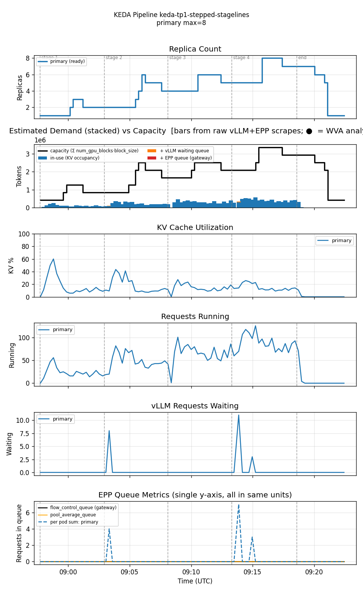
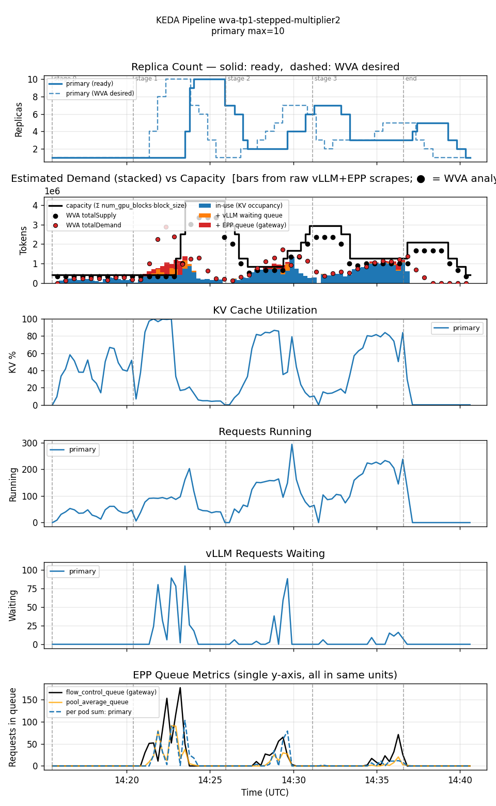

<!--
Table formatting rules for this doc (keep alignment readable in the raw editor):
  1. Every cell has exactly one space of padding inside the pipes (`| cell |`).
  2. Within a table, every row uses the SAME column widths. Widen a column to
     fit its widest cell — don't leave short cells un-padded.
  3. Text columns are left-aligned; numeric columns are right-aligned.
  4. The separator row uses dashes only, with a length matching the column width.
  5. Do not vary column widths between the header, separator, and data rows.
  Regenerate all tables via `hack/format-tables.py` if adding/removing rows.
-->

# Single-variant WVA (Sat-2, multiplier=1 and multiplier=2) vs KEDA-EPP — stepped-ramp workload

Date: 2026-07-27
Namespace: `biran` (pokprod001)
Model: `unsloth/Meta-Llama-3.1-8B-Instruct`
Harness: inference-perf v0.7.0

This is a different test shape from [`comparison-wva-keda-epp-20260722`](../comparison-wva-keda-epp-20260722/comparison.md)'s 2-stage ramp (5min@rate=2 warmup, then a sustained rate=10 saturation stage). Here the workload takes **four discrete 5-minute steps** — rate 2 → 4 → 6 → 8 — specifically to isolate each control loop's reaction to a single step change, rather than one big ramp into sustained saturation.

Three legs: KEDA-EPP (baseline), WVA Sat-2 at the default `eppQueueDemandMultiplier=1.0`, and WVA Sat-2 at `eppQueueDemandMultiplier=2.0` — the config-driven follow-up to upstream PR #1468 (`ev-shindin/workload-variant-autoscaler:feat/epp-queue-multiplier`), which added the multiplier as a compile-time constant. This session promoted it to a real `SaturationScalingConfig` field so it can be swept via the existing `wva-saturation-scaling-config` ConfigMap without rebuilding the image.

## Setup

Single TP=1 decode deployment (1 GPU/pod), all three legs min=1/max=10.

**WVA Sat-2** (`guides/wva-sat2-tp1`)
- `scaleUpThreshold: 0.85`, `scaleDownBoundary: 0.70` (V2 defaults), `kvCacheThreshold: 0.80`, `queueLengthThreshold: 5`.
- `eppQueueDemandMultiplier`: `1.0` (default, no-op) for the first WVA leg, `2.0` for the second — the only config difference between the two WVA legs.
- EPP `flowControl` gate active and its queue-depth metric genuinely nonzero (confirmed via raw scrapes) in both WVA legs.
- Controller image: `ghcr.io/biranofer/llm-d-workload-variant-autoscaler:pr1468-epp-multiplier-config` (PR #1468's branch + the config-field promotion).

**KEDA-EPP** (`guides/keda-epp-tp1`, `scaledobject-t50.yaml`)
- `sum(inference_extension_flow_control_queue_size)` threshold=50/pod avg, `sum(inference_objective_running_requests)` threshold=16/pod avg. `pollingInterval: 15s`, `cooldownPeriod: 300s`.

All three share the same native-HPA behavior: ScaleUp Percent=100/15s stab=0s; ScaleDown Percent=100/15s stab=120s.

**Workload** (`prefill_heavy_4k1k_2_4_6_8`, Poisson arrival): input ≈4000 tokens, output ≈1000 tokens. 4 stages × 5 min at rate 2, 4, 6, 8. 6000 requests total (1500/stage at the nominal rate × duration, actual per-stage counts vary slightly with Poisson variance).

## Getting a trustworthy WVA (multiplier=1) run took 5 attempts

Documenting this transparently since two different real problems — one environmental, one process — cost 4 discarded attempts before landing the result below.

1. **Attempt 1**: cluster-wide GPU contention (`FailedScheduling: Insufficient nvidia.com/gpu`) capped ready replicas at 4 for the *entire* run, despite `maxReplicas=10` and WVA's own desired target correctly requesting up to 10. Discarded — catastrophic stage-1 TTFT (p50=59s/p95=133s/p99=164s) was a cluster artifact, not a WVA behavior.
2. **Attempt 2**: cleaner overall, but a ~5 min GPU-scheduling-delayed cold start during the rate=4 step still produced a bad TTFT tail (p95=86s). `FailedScheduling` events confirmed present but brief (1.5 min), not sustained — better than attempt 1 but still contamination.
3. **Attempt 3**: killed before completion. Realized the WVA controller had never been restarted since attempt 1 — `SaturationAnalyzer.computeK2`'s per-model/accelerator/GPU-count/output-bucket rolling-average history (`internal/engines/analyzers/saturation_v2/analyzer.go`) is in-memory and persists for the controller pod's entire lifetime, evicted only after 24h of disuse. Attempts 1 and 2's contention-distorted k2 samples were still blending into attempt 3's estimates. A prior memory claiming `benchmark-run` auto-restarts the controller turned out to be stale — verified the current `Makefile` does **not** do this; it must be run manually (`make benchmark-restart-controller`) before every run.
4. **Attempt 4**: killed mid-run after restarting the controller. Checked cluster-wide GPU allocation directly (`oc get pods -A` summed against `oc get nodes` allocatable) and found the shared cluster at ~100% GPU utilization (77 of 73 allocatable-on-schedulable requested, across 22 other tenant namespaces) — continuing would almost certainly hit the same wall attempt 1 did.
5. **Attempt 5 (this result)**: controller restarted fresh, waited for cluster GPU headroom to reappear (down to 58/73, then 52/73 requested), relaunched. **Zero `FailedScheduling` events during the entire run window** (confirmed via `oc get events`) — the stage-1 TTFT spike documented below is real WVA control-loop behavior, not contamination.

## Getting the multiplier=2.0 leg took 2 attempts

A different, unrelated bug: the first multiplier=2.0 attempt got **OOMKilled** — the harness pod itself (`inference-perf-<pod> 0/1 OOMKilled`, visible in `pod_status.txt`), not a benchmark/config problem. `wva-sat2-tp1.yaml` and `keda-epp-tp1.yaml` had never picked up the harness memory bump (32Gi → 64Gi) that `two-variant-wva.yaml` already needed for this same 1000-token-mean workload — the KEDA-EPP leg above happened to complete without hitting it, which is why the bug was still latent. Fixed both scenario files (`harness.resources: {cpu: 16, memory: 64Gi}`), restarted the controller again, and reran — clean completion, zero `FailedScheduling` events, results below.

## Results

| metric                       | KEDA-EPP | WVA (mult=1) | WVA (mult=2) |
|------------------------------|----------|--------------|--------------|
| requests                     |     6000 |         6000 |         6000 |
| errors                       |       33 |           73 |          122 |
| error rate                   |    0.55% |        1.22% |        2.03% |
| avg replicas                 |     4.12 |         3.41 |         3.53 |
| max replicas                 |        8 |           10 |           10 |
| cost (avg replicas × GPU/hr) |     4.12 |         3.41 |         3.53 |
| avg KV cache utilization     |    12.0% |        24.8% |        23.9% |
| avg EPP queue depth          |      0.0 |          5.4 |          5.7 |
| avg pod startup (s)          |       98 |           94 |           94 |
| TTFT p50 (ms)                |      150 |          230 |          320 |
| TTFT p95 (ms)                |      400 |       49,360 |       29,570 |
| TTFT p99 (ms)                |    4,190 |       74,380 |       58,720 |
| Request latency p50 (ms)     |   11,700 |       17,760 |       23,680 |
| Request latency p95 (ms)     |   17,410 |       77,310 |       63,650 |
| Request latency p99 (ms)     |   20,420 |      100,830 |       89,040 |

Per-stage TTFT and error breakdown, one table per leg:

**KEDA-EPP**

| stage (rate) | p50   | p95   | p99   | errors |
|--------------|-------|-------|-------|--------|
| 0 (2)        | 0.14s | 0.27s | 0.50s |      6 |
| 1 (4)        | 0.15s | 0.32s | 3.37s |      9 |
| 2 (6)        | 0.14s | 0.40s | 4.52s |      8 |
| 3 (8)        | 0.15s | 0.51s | 4.41s |     10 |

**WVA (mult=1)**

| stage (rate) | p50    | p95    | p99    | errors |
|--------------|--------|--------|--------|--------|
| 0 (2)        | 0.16s  | 0.30s  | 0.38s  |      0 |
| 1 (4)        | 22.21s | 74.37s | 75.47s |      0 |
| 2 (6)        | 0.30s  | 15.29s | 17.69s |     48 |
| 3 (8)        | 0.18s  | 0.74s  | 4.42s  |     25 |

**WVA (mult=2)**

| stage (rate) | p50   | p95    | p99    | errors |
|--------------|-------|--------|--------|--------|
| 0 (2)        | 0.16s | 0.29s  | 0.40s  |      0 |
| 1 (4)        | 9.38s | 58.66s | 71.36s |     10 |
| 2 (6)        | 0.52s | 20.43s | 28.73s |     64 |
| 3 (8)        | 0.36s | 9.80s  | 13.88s |     48 |

Reproducing:

| run          | results dir                                                             |
|--------------|-------------------------------------------------------------------------|
| KEDA-EPP     | `biran-20260727-115648-951/results/inference-perf-1785142652-x7llu9_1/` |
| WVA (mult=1) | `biran-20260727-160256-405/results/inference-perf-1785157416-ozum1a_1/` |
| WVA (mult=2) | `biran-20260727-171350-364/results/inference-perf-1785161725-ttwjj2_1/` |

## Graphs

### KEDA-EPP — flat and clean across every step

No stage shows a meaningful TTFT tail — KEDA-EPP's aggressive scaleUp policy (Percent=100/15s, no stabilization window) reacts to each rate step almost immediately. Its 33 errors are small and spread evenly (6–10 per stage) rather than clustered — consistent with ordinary transient noise, not a backlog pileup.

### WVA (mult=1) — stuck at 1 replica through the rate=4 step, then a single rapid catch-up scale to cap

`readyPods` stayed at 1 from the start of stage 1 (rate=4) until ~5.5 minutes in, while running/waiting requests and the EPP flow-control queue built a genuine backlog (waiting requests peaked at 181, EPP queue at 228). Once pods started coming ready, WVA scaled rapidly (1→2→3→4→7→8→10) and the backlog cleared in a single overshoot-and-correct cycle; stage 3 (the highest nominal rate, 8) ran cleanly with p95=0.74s.

### WVA (mult=2) — faster initial reaction, but repeated oscillation through stages 2–3

Doubling the EPP-queue-demand weight makes WVA react to the stage-1 spike noticeably faster — desired target jumps to 10 almost immediately, and stage 1's p50/p95 both improve over the mult=1 leg. But the replica-count panel shows the cost of that aggressiveness: instead of one overshoot-and-settle, replicas oscillate repeatedly through the rest of the run (7→4→2→4→7→3→6→3→5→3→5→2→1), with **three separate** EPP-queue-burst/waiting-request spikes (stage 1, mid stage 2, mid stage 3) instead of mult=1's single spike. Stages 2 and 3 both end up *worse* than the mult=1 baseline, and total errors rise from 73 to 122.

## Reading these numbers

**Multiplier=2.0 is a real trade-off, not a clear win or loss.** It reduces the *aggregate* TTFT tail (p95 49.4s→29.6s, p99 74.4s→58.7s) because it reacts faster to the single biggest spike (stage 1) that dominates the mult=1 leg's percentiles. But it does this by amplifying an already-volatile queue-demand term, which overshoots and then oscillates instead of settling — producing worse per-stage tails in stages 2 and 3, and a higher overall error count (73→122, 1.22%→2.03%). This is exactly the asymmetric-risk shape flagged in the original review of upstream PR #1468: values above 1.0 buy faster reaction to sudden spikes at the cost of steady-state stability once the system is already scaling.

**This generalizes the earlier "why did TTFT get worse with more pods" finding** (from the 2-stage two-variant comparison) to a different workload shape and now to a config variant: at a sudden ~2× load step, WVA's two-hop control loop (WVA reconcile → KEDA poll) plus the ~90–100s pod-startup cost produces a real backlog before capacity catches up. Multiplier=1 does this once, cleanly; multiplier=2 does it faster the first time but keeps re-triggering it.

**Cost is essentially unaffected by the multiplier** (avg replicas 3.41 vs 3.53, both far below KEDA-EPP's 4.12) — the multiplier changes *when* WVA reacts, not how many replicas it ultimately settles on.

## Honest conclusions

1. **WVA's reaction-lag tail latency at load steps is real and reproducible**, now confirmed across two different workload shapes with cluster contention explicitly ruled out. A sudden ~2× step produces a multi-minute backlog before replicas catch up.
2. **The multiplier=2.0 experiment shows a genuine trade-off, not an improvement.** Faster initial reaction pulls down aggregate percentiles, but at the cost of repeated oscillation and a ~66% increase in total errors (73→122). Recommend against raising this multiplier above 1.0 by default without also addressing the oscillation risk (e.g. hysteresis/damping on the queue-demand term) — matches the asymmetric-risk concern raised in the original PR #1468 review.
3. **The single-variant cost advantage (WVA ~17-20% cheaper than KEDA-EPP) is real but modest and multiplier-independent** — far smaller than the ~3× seen when WVA's cost-aware prioritization has two differently-priced variants to choose between.
4. **This result cost 7 attempts total** — 5 for the multiplier=1 leg (2 discarded to genuine cluster-wide GPU contention, 1 killed on discovering the controller hadn't been restarted since the first attempt, 1 killed after confirming ~100% cluster GPU utilization) and 2 for the multiplier=2 leg (1 OOMKilled on a harness-memory bug latent in both single-variant scenario files, fixed and rerun clean). On a heavily-shared cluster, always verify GPU headroom and restart the WVA controller before trusting a run's numbers — and don't assume a scenario file is safe just because one prior leg completed on it.
5. **KEDA-EPP's own error rate (0.55%) is unrelated to the tail-latency story** — its errors are small, uniform across all four stages, and not clustered around any particular step, unlike either WVA leg's stage-concentrated pileups.
