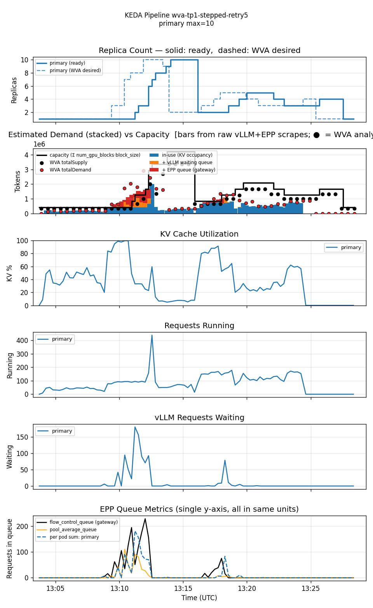

<!--
Table formatting rules for this doc (keep alignment readable in the raw editor):
  1. Every cell has exactly one space of padding inside the pipes (`| cell |`).
  2. Within a table, every row uses the SAME column widths. Widen a column to
     fit its widest cell — don't leave short cells un-padded.
  3. Text columns are left-aligned; numeric columns are right-aligned.
  4. The separator row uses dashes only, with a length matching the column width.
  5. Do not vary column widths between the header, separator, and data rows.
  Regenerate all tables via `hack/format-tables.py` if adding/removing rows.
-->

# Single-variant WVA (Sat-2) vs KEDA-EPP — stepped-ramp workload

Date: 2026-07-27
Namespace: `biran` (pokprod001)
Model: `unsloth/Meta-Llama-3.1-8B-Instruct`
Harness: inference-perf v0.7.0

This is a different test shape from [`comparison-wva-keda-epp-20260722`](../comparison-wva-keda-epp-20260722/comparison.md)'s 2-stage ramp (5min@rate=2 warmup, then a sustained rate=10 saturation stage). Here the workload takes **four discrete 5-minute steps** — rate 2 → 4 → 6 → 8 — specifically to isolate each control loop's reaction to a single step change, rather than one big ramp into sustained saturation.

## Setup

Single TP=1 decode deployment (1 GPU/pod), both legs min=1/max=10.

**WVA Sat-2** (`guides/wva-sat2-tp1`)
- `scaleUpThreshold: 0.85`, `scaleDownBoundary: 0.70` (V2 defaults), `kvCacheThreshold: 0.80`, `queueLengthThreshold: 5`, `eppQueueDemandMultiplier: 1.0` (default — the config-driven multiplier from the PR #1468 follow-up exists but this run uses the no-op default, not a swept value).
- EPP `flowControl` gate active and its queue-depth metric genuinely nonzero (confirmed via raw scrapes).

**KEDA-EPP** (`guides/keda-epp-tp1`, `scaledobject-t50.yaml`)
- `sum(inference_extension_flow_control_queue_size)` threshold=50/pod avg, `sum(inference_objective_running_requests)` threshold=16/pod avg. `pollingInterval: 15s`, `cooldownPeriod: 300s`.

Both share the same native-HPA behavior: ScaleUp Percent=100/15s stab=0s; ScaleDown Percent=100/15s stab=120s.

**Workload** (`prefill_heavy_4k1k_2_4_6_8`, Poisson arrival): input ≈4000 tokens, output ≈1000 tokens. 4 stages × 5 min at rate 2, 4, 6, 8. 6000 requests total (1500/stage at the nominal rate × duration, actual per-stage counts vary slightly with Poisson variance).

## Getting a trustworthy WVA run took 5 attempts

Documenting this transparently since two different real problems — one environmental, one process — cost 4 discarded attempts before landing the result below.

1. **Attempt 1**: cluster-wide GPU contention (`FailedScheduling: Insufficient nvidia.com/gpu`) capped ready replicas at 4 for the *entire* run, despite `maxReplicas=10` and WVA's own desired target correctly requesting up to 10. Discarded — catastrophic stage-1 TTFT (p50=59s/p95=133s/p99=164s) was a cluster artifact, not a WVA behavior.
2. **Attempt 2**: cleaner overall, but a ~5 min GPU-scheduling-delayed cold start during the rate=4 step still produced a bad TTFT tail (p95=86s). `FailedScheduling` events confirmed present but brief (1.5 min), not sustained — better than attempt 1 but still contamination.
3. **Attempt 3**: killed before completion. Realized the WVA controller had never been restarted since attempt 1 — `SaturationAnalyzer.computeK2`'s per-model/accelerator/GPU-count/output-bucket rolling-average history (`internal/engines/analyzers/saturation_v2/analyzer.go`) is in-memory and persists for the controller pod's entire lifetime, evicted only after 24h of disuse. Attempts 1 and 2's contention-distorted k2 samples were still blending into attempt 3's estimates. A prior memory claiming `benchmark-run` auto-restarts the controller turned out to be stale — verified the current `Makefile` does **not** do this; it must be run manually (`make benchmark-restart-controller`) before every run.
4. **Attempt 4**: killed mid-run after restarting the controller. Checked cluster-wide GPU allocation directly (`oc get pods -A` summed against `oc get nodes` allocatable) and found the shared cluster at ~100% GPU utilization (77 of 73 allocatable-on-schedulable requested, across 22 other tenant namespaces) — continuing would almost certainly hit the same wall attempt 1 did.
5. **Attempt 5 (this result)**: controller restarted fresh, waited for cluster GPU headroom to reappear (down to 58/73, then 52/73 requested), relaunched. **Zero `FailedScheduling` events during the entire run window** (confirmed via `oc get events`) — the stage-1 TTFT spike documented below is real WVA control-loop behavior, not contamination.

## Results

| metric                       |     WVA | KEDA-EPP |
|------------------------------|---------|----------|
| requests                     |    6000 |     6000 |
| errors                       |      73 |       33 |
| error rate                   |   1.22% |    0.55% |
| avg replicas                 |    3.41 |     4.12 |
| max replicas                 |      10 |        8 |
| cost (avg replicas × GPU/hr) |    3.41 |     4.12 |
| avg KV cache utilization     |   24.8% |    12.0% |
| avg EPP queue depth          |     5.4 |      0.0 |
| avg pod startup (s)          |      94 |       98 |
| TTFT p50 (ms)                |     230 |      150 |
| TTFT p95 (ms)                |  49,360 |      400 |
| TTFT p99 (ms)                |  74,380 |    4,190 |
| Request latency p50 (ms)     |  17,760 |   11,700 |
| Request latency p95 (ms)     |  77,310 |   17,410 |
| Request latency p99 (ms)     | 100,830 |   20,420 |

Per-stage TTFT and error breakdown:

| stage (rate) | WVA p50 | WVA p95 | WVA p99 | WVA err | KEDA p50 | KEDA p95 | KEDA p99 | KEDA err |
|--------------|---------|---------|---------|---------|----------|----------|----------|----------|
| 0 (2)        | 0.16s   | 0.30s   | 0.38s   |       0 | 0.14s    | 0.27s    | 0.50s    |        6 |
| 1 (4)        | 22.21s  | 74.37s  | 75.47s  |       0 | 0.15s    | 0.32s    | 3.37s    |        9 |
| 2 (6)        | 0.30s   | 15.29s  | 17.69s  |      48 | 0.14s    | 0.40s    | 4.52s    |        8 |
| 3 (8)        | 0.18s   | 0.74s   | 4.42s   |      25 | 0.15s    | 0.51s    | 4.41s    |       10 |

Reproducing:

| run      | results dir                                                             |
|----------|-------------------------------------------------------------------------|
| WVA      | `biran-20260727-160256-405/results/inference-perf-1785157416-ozum1a_1/` |
| KEDA-EPP | `biran-20260727-115648-951/results/inference-perf-1785142652-x7llu9_1/` |

## Graphs

### WVA — stuck at 1 replica through the rate=4 step, then a rapid catch-up scale to cap

`readyPods` stayed at 1 from the start of stage 1 (rate=4) until ~5.5 minutes in, while running/waiting requests and the EPP flow-control queue built a genuine backlog (waiting requests peaked at 181, EPP queue at 228) — confirmed not a scheduling artifact for this specific run. Once pods started coming ready, WVA scaled rapidly (1→2→3→4→7→8→10) and the backlog cleared; stage 3 (the highest nominal rate, 8) ran cleanly with p95=0.74s.

### KEDA-EPP — flat and clean across every step

No stage shows a meaningful TTFT tail — KEDA-EPP's aggressive scaleUp policy (Percent=100/15s, no stabilization window) reacts to each rate step almost immediately. Its 33 errors are small and spread evenly (6–10 per stage) rather than clustered — consistent with ordinary transient noise, not a backlog pileup.

## Reading these numbers

**This generalizes the earlier "why did TTFT get worse with more pods" finding** from the 2-stage two-variant comparison to a different workload shape: at a sudden ~2× load step (not just the specific 2→10 ramp used there), WVA's two-hop control loop (WVA reconcile → KEDA poll) plus the ~90–100s pod-startup cost produces a real backlog before capacity catches up. The resulting TTFT percentiles reflect the unlucky cohort caught in that pileup, not the system's steady-state capacity — which is why stage 3, at double stage 1's rate, ran clean once replicas had caught up.

**Cost**: WVA averaged 3.41 replicas vs KEDA-EPP's 4.12 — about 17% cheaper. This is a real but much smaller advantage than the ~3× seen in the two-variant cost-aware comparison, because a single-variant setup gives WVA no cost-prioritization axis to exploit; the gap here is purely a byproduct of WVA's threshold-based scaling being more conservative than KEDA-EPP's aggressive Percent=100 scaleUp policy.

**Is the tail latency a real reliability concern?** Yes, for workloads with sudden load steps — this is now confirmed across two different workload shapes (the 2-stage ramp and this 4-stage stepped ramp) and, in this run, explicitly ruled out as a cluster-contention artifact. It's a genuine control-loop reaction-time cost of WVA's current architecture, not a fluke.

## Honest conclusions

1. **WVA's reaction-lag tail latency at load steps is real and reproducible**, now confirmed across two different workload shapes with cluster contention explicitly ruled out for this run. A sudden ~2× step produces a multi-minute backlog before replicas catch up, producing p95/p99 TTFT in the tens of seconds; the same system recovers to sub-second TTFT once caught up, even at a higher nominal rate.
2. **The single-variant cost advantage (17%) is real but modest** — far smaller than the ~3× seen when WVA's cost-aware prioritization has two differently-priced variants to choose between. Single-variant WVA is essentially "KEDA-EPP with more conservative thresholds," not a fundamentally different mechanism.
3. **This result cost 5 attempts** — 2 discarded to genuine cluster-wide GPU contention from other tenants sharing pokprod001, 1 killed on discovering the controller hadn't been restarted since the first attempt (in-memory k2-history contamination — a real methodological gap, now fixed as a standing rule), 1 killed after confirming the shared cluster was at ~100% GPU utilization. On a heavily-shared cluster, always verify GPU headroom and restart the WVA controller before trusting a run's numbers.
4. **KEDA-EPP's own error rate (0.55%) is unrelated to the tail-latency story** — its errors are small, uniform across all four stages, and not clustered around any particular step, unlike WVA's stage-1-concentrated pileup.
