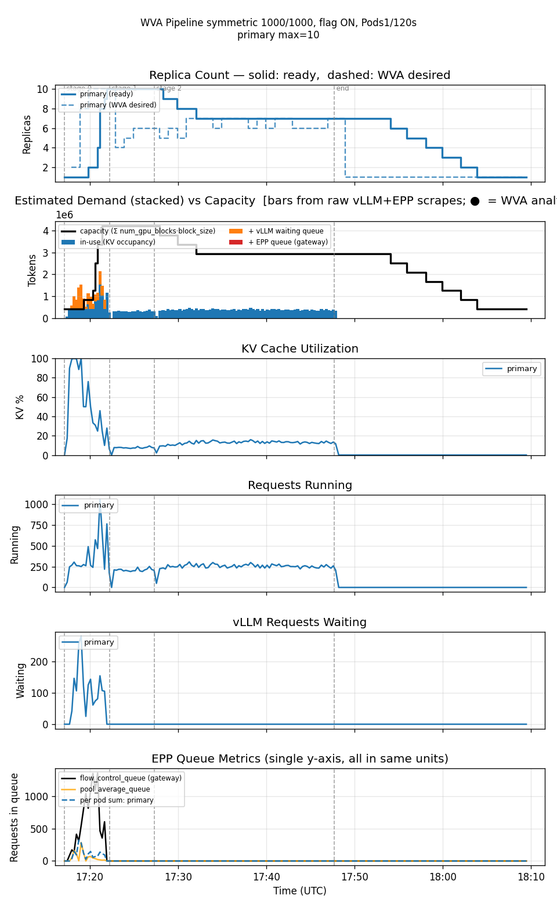
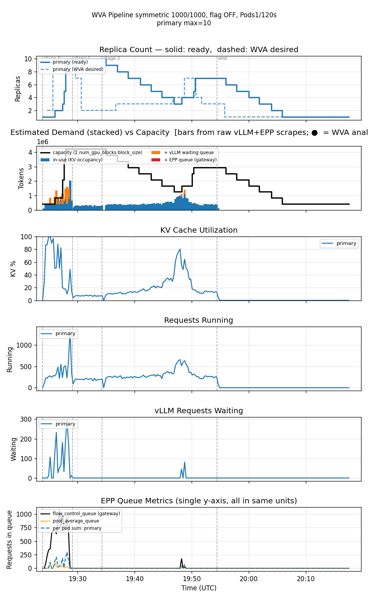
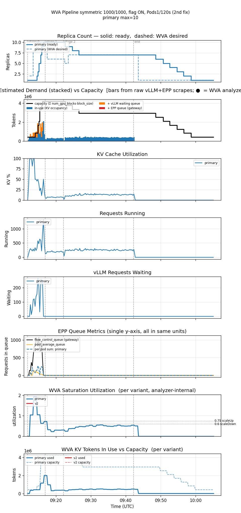
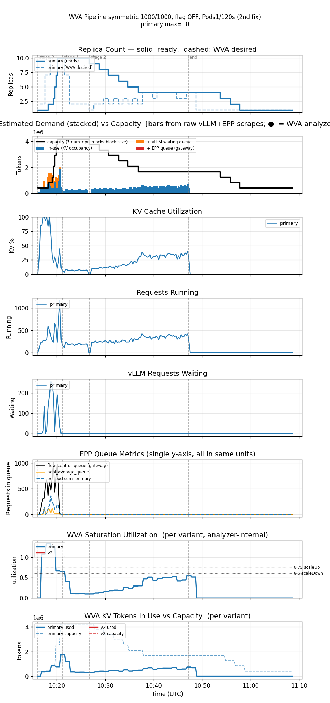

<!--
Table formatting rules for this doc (keep alignment readable in the raw editor):
  1. Every cell has exactly one space of padding inside the pipes (`| cell |`).
  2. Within a table, every row uses the SAME column widths. Widen a column to
     fit its widest cell — don't leave short cells un-padded.
  3. Text columns are left-aligned; numeric columns are right-aligned.
  4. The separator row uses dashes only, with a length matching the column width.
  5. Do not vary column widths between the header, separator, and data rows.
-->

# Rate-anchored k2 (PR #1501) — flag ON vs OFF, symmetric 1000/1000 tokens

Date: 2026-08-01
Namespace: `biran` (pokprod001)
Model: `unsloth/Meta-Llama-3.1-8B-Instruct`
Harness: inference-perf v0.7.0
Branch: `validate/rate-anchored-k2`

## Why this doc exists

Continuation of [`comparison-1000x250-rateanchoredk2-20260731`](../comparison-1000x250-rateanchoredk2-20260731/comparison.md), which validated [PR #1501](https://github.com/llm-d/llm-d-workload-variant-autoscaler/pull/1501)'s rate-anchored `k2` estimator on a **prefill-heavy** workload (1000 input / 250 output tokens). This doc tests a **symmetric** workload (1000 input / 1000 output tokens) instead — same input size, but 4x the output length, and no known-good historical baseline to compare against (this token shape hasn't been run before). All four legs use the same `Pods1/120s` KEDA `scaleDown` policy that leg 1c/1c-v2 used there; the first ON/OFF pair used the PR's first-update revision (`89d152e2`), the second pair used the PR's next revision (`cc42e820`, 2 more commits) after it was updated again mid-validation.

## Setup

Single TP=1 decode deployment (1 GPU/pod), min=1/max=10, `scaleUpThreshold=0.75`, `scaleDownBoundary=0.60` (live-patched into the saturation ConfigMap). ScaledObject `scaleUp` Percent100/15s (window 0s), `scaleDown` **Pods 1/120s** (window 300s).

Flag toggled via two separately built images per PR revision (`EnableRateAnchoredK2` is a Go build-time const, not runtime-toggleable), both pinned by digest on the controller Deployment to avoid `IfNotPresent` tag-cache staleness:
- ON/OFF (first pair): commit `38db3553` (includes PR commits through `89d152e2`) — `-on` `@sha256:866cf900...`, `-off` `@sha256:72189a36...` (rebuilt for this doc; the previously-tagged `-off` image predated this PR update).
- ON/OFF (v3, second pair): commit `e63e8cb9` (includes 2 more PR commits through `cc42e820`) — `-on` `@sha256:99b71703...`, `-off` `@sha256:8d8d18fa...`.

The v3 pair also has two infra fixes applied that the first pair lacks: the decode Deployment now has `nodeSelector: {nvidia.com/gpu.product: NVIDIA-H100-80GB-HBM3}` so WVA resolves the accelerator and emits `wva_saturation_utilization`/KV-token gauges, and the `ServiceMonitor` TLS `serverName` bug (see below) is fixed so those metrics are actually scraped.

**Workload** (`symmetric_1000_1000_16_20_24x20`, new scenario file, Poisson arrival): input 1000±100 tokens, output 1000±100 tokens (mirrors the prefill-heavy doc's input distribution onto the output side). Same 3-stage load profile: 5 min @ rate 16, 5 min @ rate 20, 20 min @ rate 24. 39,600 requests total. `per_request` reporting disabled (known OOM risk at this output size, per `prefill_heavy_4k1k_2_4_6_8.yaml.in`'s precedent).

**Caveat up front**: one run per leg, back-to-back on the same cluster, no seed control on the Poisson load. No historical baseline exists for this workload shape to sanity-check against.

## Results

| metric                        |     ON |    OFF |  ON (v3) | OFF (v3) |
|--------------------------------|-------:|-------:|---------:|---------:|
| requests                       | 39,600 | 39,600 |   39,600 |   39,600 |
| errors                         |     55 |    286 |       64 |      213 |
| error rate                     |  0.14% |  0.72% |    0.16% |    0.54% |
| avg replicas                   |   5.81 |   4.74 |     5.78 |     4.39 |
| max replicas                   |     10 |     10 |       10 |       10 |
| cost (avg replicas × GPU/hr)   |   5.81 |   4.74 |     5.78 |     4.39 |
| avg KV cache utilization       |   9.6% |  12.8% |     9.5% |    14.3% |
| avg EPP queue depth            |   5.23 |   2.27 |     4.48 |     3.01 |
| avg pod startup (s)            |     96 |     87 |       81 |       73 |
| TTFT mean (s)                  |   4.79 |   4.91 |     4.83 |     4.07 |
| TTFT p50 (s)                   |   0.07 |   0.08 |     0.07 |     0.08 |
| TTFT p90 (s)                   |   7.40 |   8.02 |     2.12 |     3.91 |
| TTFT p99 (s)                   |  77.25 |  69.30 |    73.44 |    63.72 |
| Request latency mean (s)       |  17.35 |  18.93 |    17.18 |    18.17 |
| Request latency p99 (s)        | 106.30 |  99.66 |   105.23 |    92.91 |
| ITL mean (s)                   |  0.013 |  0.014 |    0.012 |    0.014 |
| Max EPP flow-control queue     |  1,355 |  1,069 |    1,068 |    1,012 |
| Max vLLM waiting requests      |    280 |    296 |      265 |      255 |

Reproducing:

| run     | results dir                                                             |
|---------|--------------------------------------------------------------------------|
| ON      | `biran-20260731-201550-402/results/inference-perf-1785518226-bv6ryv_1/`  |
| OFF     | `biran-20260731-222304-530/results/inference-perf-1785525827-gfgk14_1/`  |
| ON (v3) | `biran-20260801-121102-872/results/inference-perf-1785575505-xuwkke_1/`  |
| OFF (v3)| `biran-20260801-131517-881/results/inference-perf-1785579363-vl9tvn_1/`  |

## Replica timeline (decode, collapsed to transitions)

**ON** — 14 transitions, ramps to cap fast then a single long drain:

```
1 → 2 → 4 → 8 → 9 → 10 → 9 → 8 → 7 → 6 → 5 → 4 → 3 → 2 → 1
```

Hits the max replica cap (10) within ~5 minutes of load starting — scale-**up** isn't throttled by `Pods1/120s` (that policy only governs scale-down). Drains metered 1-pod-at-a-time from 10 down to 7, then **holds flat at 7 for ~22 minutes** (17:32–17:54) before draining the rest of the way to 1 as load ends. One ramp, one hold, one drain — no second oscillation.

**OFF** — 21 transitions, same fast ramp to cap, but a genuine second cycle:

```
1 → 2 → 3 → 5 → 8 → 10 → 9 → 8 → 7 → 6 → 5 → 4 → 3 → 4 → 5 → 7 → 6 → 5 → 4 → 3 → 2 → 1
```

Also hits 10 within ~5 minutes, drains metered down to 3 by ~19:47 — but then, unlike ON, **re-ramps mid-run** (3→4→5→7 between 19:48–19:51) before draining again to 1 at the end. A real second demand echo appears in the graph (see below) that ON's run either didn't experience or handled without needing to re-scale.

**ON (v3)** — 15 transitions, same fast ramp, one long hold, one drain (matches the first ON leg's shape):

```
1 → 2 → 3 → 5 → 7 → 9 → 10 → 9 → 8 → 7 → 6 → 5 → 4 → 3 → 2 → 1
```

Hits 10 within ~4.5 minutes, drains to 7 within another ~10 minutes, **holds flat at 7 for ~22 minutes** (09:26–09:48), then drains cleanly to 1. No second oscillation — reproduces the first ON leg's pattern on the PR's next revision.

**OFF (v3)** — 14 transitions, same fast ramp, but *no* second oscillation this time (unlike the first OFF leg):

```
1 → 2 → 3 → 5 → 7 → 10 → 9 → 8 → 7 → 6 → 5 → 4 → 3 → 2 → 1
```

Hits 10 within ~4 minutes, drains metered all the way down to 4 by 10:36, **holds at 4 for ~17 minutes** (10:36–10:53) rather than re-ramping, then drains the rest of the way to 1. The graph shows utilization climbing gradually during that hold (from ~0.15 up to ~0.55) but it never crosses the 0.60 scaleDown boundary the wrong way to trigger a re-scale — unlike the first OFF leg's genuine re-ramp to 7.

## Graphs

`wva_saturation_utilization`/`wva_kv_cache_tokens` panels are absent from both plots — the WVA
controller's own Prometheus metrics were never scraped for either run (root cause found and
fixed for future runs: the `ServiceMonitor`'s `tlsConfig.serverName` was hardcoded to
`wva-system` instead of the actual `biran` namespace, failing TLS verification on every scrape
attempt — see the feedback note on this bug). Not recoverable for these two runs after the fact.

Dashed gray vertical lines mark the Poisson load-profile's stage transitions and the point where
arrivals stop (measured elapsed seconds per stage, not nominal) — **not** where all activity
stops. Both graphs' x-axis extends well past that "end" line: in-flight requests (up to ~1000
output tokens each) keep decoding, and the `Pods1/120s` policy metering the descent from a peak
of 7-10 replicas back to 1 alone takes 12+ minutes. `harness_stop` lands 23 minutes after the
arrival schedule's nominal end for both legs — that tail is genuine data, not a rendering
artifact.

The OFF run's `wva_target_timeseries.json` (WVA-desired dashed overlay) initially came back
empty (0 snapshots) due to a transient `kubectl` auth failure at the exact moment
`post_run_analyze.sh` ran (the same session-token expiry hit later while querying Thanos) —
the dump script doesn't surface that failure, it just silently writes an empty result. Recovered
by re-running the dump: the controller pod hadn't been restarted since the run, so the log
history was still live-queryable.

### ON — one ramp, one long hold, one drain



The demand spike is concentrated entirely in the first ~6 minutes (KV cache hits 100%, vLLM
waiting queue peaks at 280, EPP flow-control queue peaks at 1,355) — a cold-start effect from a
handful of 1000-output-token requests saturating a single replica before WVA can scale up. Once
replicas catch up, the rest of the ~31-minute load window is calm: queue near 0, ~250 requests
running steadily, holding at 7 replicas for a long stretch before a clean drain.

### OFF — same cold start, plus a second demand echo mid-run



Same violent cold-start burst in the first ~6 minutes. But after draining to 3 replicas by
~19:47, a second, smaller demand spike appears around 19:48–19:50 (KV cache climbs back to ~80%,
requests running climbs back to ~650, waiting queue ticks up to ~80) that ON's run never shows —
triggering the second replica ramp described above.

### ON (v3) — same cold start, same long hold, plus working utilization/KV-token panels



Reproduces the first ON leg almost exactly: violent cold-start burst, hold at 7 for ~22 minutes,
clean drain. New here: the analyzer-internal utilization panel shows the hold period sitting
consistently between 0.4 and 0.6 — below the 0.75 scaleUp line but never dropping far enough
below 0.60 to justify draining below 7 until the load itself eases near the end.

### OFF (v3) — same cold start, no second oscillation this time



Unlike the first OFF leg, no re-ramp: after the cold-start burst, replicas drain to 4 and hold
there for ~17 minutes while utilization climbs gradually from ~0.15 to ~0.55 — approaching but
never crossing the 0.60 scaleDown boundary the wrong way. The KV-cache-utilization panel shows
the same gradual climb (from ~8% up to ~40%) that would, on the first OFF leg's slightly
different Poisson draw, have been enough to trigger a re-scale.

## Reading these numbers

**OFF has 5x the error rate of ON** (286 vs 55, 0.72% vs 0.14%) on this workload — a much larger gap than the prefill-heavy doc's Percent100 comparison (2x). OFF's *average* EPP queue depth is lower than ON's (2.27 vs 5.23), which looks counterintuitive next to OFF's higher error count — but it's explained by OFF holding fewer average replicas overall (4.74 vs 5.81), so its queue reads low across most of a longer, lower-capacity run rather than because demand was genuinely lighter. The *peak* EPP flow-control queue is higher under ON (1,355 vs 1,069), consistent with ON's replica count peaking higher too — average and peak queue depth are telling different stories here, and neither maps cleanly onto the error-count gap.

**The replica-timeline difference from the first pair — OFF shows a genuine second oscillation cycle that ON does not — did NOT reproduce on the v3 pair.** Both v3 legs show the same shape as each other and as the first ON leg: one ramp, one long hold, one clean drain, no second oscillation. The v3 OFF leg's utilization climbed steadily during its hold (toward, but never past, the 0.60 scaleDown boundary the wrong way) instead of re-ramping. This strongly suggests the first pair's headline "OFF re-oscillates, ON doesn't" finding **was workload-random-seed luck, not a flag effect** — exactly the risk flagged as unconfirmed in the original write-up, now borne out by a second independent run under the same code showing no such difference.

**The error-rate gap direction and rough magnitude DID reproduce, though.** First pair: OFF 5x ON (286 vs 55). v3 pair: OFF 3.3x ON (213 vs 64). Both pairs show OFF with meaningfully more errors than ON, on two independent Poisson draws, across two different PR revisions — this is the more likely genuine effect of the two headline findings from the first pair.

**Tail latency is bad under all four legs on this workload, and doesn't favor either flag setting.** TTFT p99 ranges 63-77s and request latency p99 ranges 93-106s across all four legs, driven by the shared cold-start burst in the first few minutes rather than by the flag.

## Honest conclusions

1. **This is a much harder workload than the prefill-heavy series** — all four legs hit the 10-replica cap and all show extreme tail latency (TTFT p99 64-77s) driven by an initial cold-start burst before WVA can scale up. Neither flag setting avoids this; it appears to be inherent to how quickly a single replica saturates on 1000-token outputs.
2. **Flag ON has fewer errors on this workload in both independent pairs** (55 vs 286, then 64 vs 213) — a real, reproducing effect, though the magnitude varies (5x, then 3.3x) across the two Poisson draws and PR revisions.
3. **The mid-run second-oscillation difference seen in the first pair did NOT reproduce in the v3 pair — treat it as workload-random-seed noise, not a flag effect.** This is exactly the caveat the first write-up flagged as unconfirmed; the second pair confirms the caveat was warranted. A genuine visual difference between two runs is not the same as a difference caused by the variable you changed.
4. **No historical baseline exists for this token shape**, unlike the prefill-heavy series' well-tested 1000/250 profile — so unlike that doc, there's nothing here to sanity-check "is WVA behaving reasonably at all" against, only ON vs OFF against each other.
5. **Metrics gap discovered and fixed mid-validation, not backfillable for the first pair**: the WVA controller's own Prometheus metrics (`wva_saturation_utilization`, KV-token capacity/used) were never scraped for the first pair, due to two compounding bugs — an accelerator-resolution gap (missing `nodeSelector` on the decode Deployment) and a `ServiceMonitor` TLS `serverName` bug (hardcoded `wva-system`). Both fixed before the v3 pair, which has the full graph set as a result.
