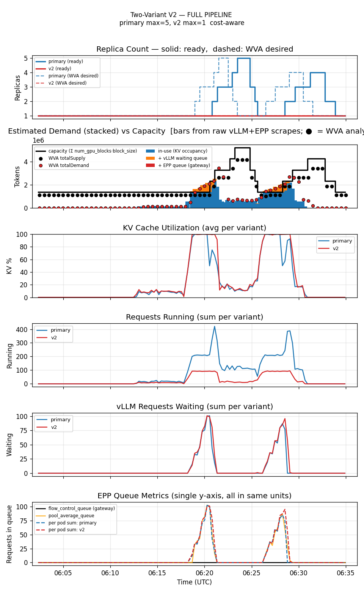
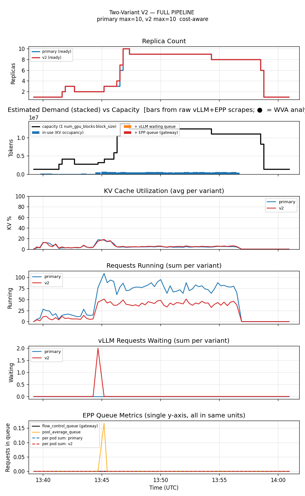

<!--
Table formatting rules for this doc (keep alignment readable in the raw editor):
  1. Every cell has exactly one space of padding inside the pipes (`| cell |`).
  2. Within a table, every row uses the SAME column widths. Widen a column to
     fit its widest cell — don't leave short cells un-padded.
  3. Text columns are left-aligned; numeric columns are right-aligned.
  4. The separator row uses dashes only, with a length matching the column width.
  5. Do not vary column widths between the header, separator, and data rows.
  Regenerate all tables via `hack/format-tables.py` if adding/removing rows.
-->

# Two-variant WVA (Sat-2, cost-aware) vs KEDA-EPP autoscaling

Date: 2026-07-25
Namespace: `biran` (pokprod001)
Model: `unsloth/Meta-Llama-3.1-8B-Instruct`
Harness: inference-perf v0.7.0

First comparison exercising WVA's **cost-aware V2 optimizer** on its designed axis — two variants of the same model at different cost/TP — rather than the single-variant setup used in [`comparison-wva-keda-epp-20260722`](../comparison-wva-keda-epp-20260722/comparison.md). That doc's honest-conclusions section (#5) explicitly flagged this as the missing head-to-head; this is that follow-up.

## Setup

**Topology** (both legs): one shared `InferencePool`/EPP fronting two decode `Deployment`s of the same model:
- **primary**: TP=2 (2 GPU/pod), cost=10
- **variant**: TP=1 (1 GPU/pod), cost=5

Both min=1/max=10. Cost ratio (10/5) equals the GPU ratio (2/1), so a TP=2 replica is the *more* GPU-efficient pick per unit cost (shared weights → more KV headroom per GPU than two independent TP=1 replicas) — WVA's cost-aware solver is expected to prefer scaling primary first, spilling to the cheaper variant only when primary saturates.

**WVA Sat-2** (`guides/two-variant-wva`)
- Metric feeding HPA: `wva_desired_replicas` per variant — computed by the WVA controller from KV supply + demand + EPP queue, cost-weighted across variants.
- WVA algorithm: scaleUp when KV util > 85%; scaleDown boundary 70%.

**KEDA-EPP** (`guides/keda-epp-two-variant`, new scenario — no WVA installed at all)
- Metric feeding HPA: same two Prometheus queries as the single-variant KEDA-EPP baseline — `sum(inference_extension_flow_control_queue_size)` and `sum(inference_objective_running_requests)` — applied to **both** variants independently, each with its own `ScaledObject`.
- Because EPP only exposes pool-wide (not per-Deployment) queue/running-request signals, both ScaledObjects read the *identical* value and scale in lockstep — this is the correct behavior for the naive baseline: KEDA-EPP has no cost-awareness to differentiate the two variants at all.
- Thresholds: queue avg/pod = 50, running avg/pod = 16 (same as the single-variant `scaledobject-t50.yaml`, chosen for a fairer comparison against WVA V2).

Both share the same KEDA HPA scaleUp/scaleDown behavior: Percent=100/15s, ScaleUp stab=0s, ScaleDown stab=120s.

**Workload** (`prefill_heavy_4k1k_2_10`, Poisson arrival): input ≈4000 tokens, output ≈1000 tokens, 5 min @ rate=2 (warm-up) then 12 min @ rate=10 (saturation). 7800 requests total.

## Prerequisite bug fixes — without these, the results are not trustworthy

All of these produced plausible-looking symptoms while the WVA controller's own decision log looked completely healthy — a reminder that a controller's decision log is not proof its decisions were applied, or that its inputs were correct.

1. **`add_variant.py`'s variant Deployment selector was a superset of the primary's** — inherited (never removed) the primary's `llm-d.ai/inference-serving` discriminator label, so Kubernetes' native HPA controller's `AmbiguousSelector` safety check fired for both HPAs and blocked scaling entirely. Fixed in `hack/benchmark/add_variant.py::make_variant_deployment()`.
2. **The WVA controller's `ServiceMonitor` has a hardcoded TLS `serverName`** (`wva-controller-manager-metrics-service.wva-system.svc`) that doesn't match the real tenant namespace, silently breaking the HTTPS scrape — `wva_desired_replicas` never reaches Prometheus, so KEDA's HPA always reads empty and never scales. This resets on every fresh `benchmark-standup` and is not yet fixed at the template level; requires a manual patch after every standup:
  ```
  oc patch servicemonitor wva-controller-manager-metrics-monitor -n <ns> --type=json \
    -p '[{"op":"replace","path":"/spec/endpoints/0/tlsConfig/serverName","value":"wva-controller-manager-metrics-service.<ns>.svc"}]'
  ```
3. **WVA's collector trusts a pod's `llm-d.ai/variant` label as-is whenever it's *present*** (`buildInstanceKey` in `internal/collector/replica_metrics.go`) — it only falls back to the correct owner-chain-based lookup when the label is *missing*. Two places set this label to a value that matched no tracked variant, silently dropping that pod's queue-backlog demand contribution (the in-use-KV component is attributed through a different, unaffected path, which is why the controller still scaled *something* while undercounting demand ~2×):
   - **The added variant's own label**, set by `add_variant.py` to the bare Deployment name instead of the tracked ScaledObject's name (`<deployment>-scaler`). Fixed in `make_variant_deployment()`.
   - **Primary's label**, set unconditionally by the `llm-d-benchmark` modelservice chart template (`13_ms-values.yaml.j2`, gated only on `wva.enabled`) to `<model_id_label>-decode` — baked into the Deployment's *selector* too (selector must be a subset of template labels), making it immutable once created. Rather than fight an upstream chart default we can't durably patch, `add_variant.py` now reads primary's live label and **names the primary ScaledObject to match it**, instead of assuming a fixed `<deployment>-scaler` pattern — no Deployment edit needed at all.

Verified fixed: cross-checking WVA's `totalDemand` against an independent raw-scrape estimate (`dump_capacity_demand_estimate.py`, computed directly from vLLM/EPP Prometheus scrapes with no dependency on WVA's own attribution) sample-by-sample shows the ratio sitting at ~0.9–1.3 throughout the run — matching within normal sampling noise, vs. a consistent ~0.5 before the label fixes.

Confirmed the label bug is scoped to the two-variant path specifically: all 10 result directories behind [`comparison-wva-keda-epp-20260722`](../comparison-wva-keda-epp-20260722/comparison.md)'s single-variant comparison carry *no* `llm_d_ai_variant` label on any pod at all (label absent → correct fallback path), so that doc's numbers are unaffected.

Also fixed along the way (not scaling-correctness bugs, but distort results if left alone): the harness pod's default 32Gi memory OOMKilled mid-run on this workload's 1000-token mean output (bumped to 64Gi in both scenario files), and `report.request_lifecycle.per_request: true` generated a multi-GB JSON file (observed 6GB+, 45+ minutes to collect) that nothing in the analysis pipeline reads — disabled in the workload file.

## Results

| metric                                |       WVA | KEDA-EPP   |
|---------------------------------------|-----------|------------|
| requests                              |      7800 | 7800       |
| successful                            |      7696 | 7767       |
| errors                                |       104 | **33**     |
| error rate                            |     1.33% | **0.42%** |
| achieved RPS                          |      7.14 | 7.48       |
| avg replicas (primary)                |  **1.68** | 5.58       |
| avg replicas (variant)                |  **1.00** | 5.60       |
| max replicas (primary)                |     **5** | 10         |
| max replicas (variant)                |     **1** | 10         |
| cost (weighted avg replicas × GPU/hr) |  **4.36** | 16.75      |
| avg KV cache utilization              |     21.3% | ~10%       |
| TTFT p50 (ms)                         |       211 | **132**    |
| TTFT p95 (ms)                         |    23,620 | **1,192**  |
| TTFT p99 (ms)                         |    35,968 | **5,398**  |
| Request latency p50 (ms)              |    22,903 | **12,227** |
| Request latency p95 (ms)              |    58,668 | **16,511** |
| Request latency p99 (ms)              |    66,546 | **20,100** |
| TPOT p50 (ms)                         |      24.1 | **12.5**   |
| TPOT p95 (ms)                         |      40.0 | **17.8**   |
| TPOT p99 (ms)                         |      73.8 | **30.1**   |

Reproducing:

| run      | results dir                                                             |
|----------|-------------------------------------------------------------------------|
| WVA      | `biran-20260726-090128-217/results/inference-perf-1785045730-70k1js_1/` |
| KEDA-EPP | `biran-20260725-163818-109/results/inference-perf-1784986741-1ckph5_1/` |

## Graphs

Full per-run pipeline plots (replica count with desired/ready overlay, estimated demand vs capacity, KV utilization, requests running/waiting, EPP queue depth — all vs time):

### WVA — primary scales (1→5), variant stays flat at 1



With both label-attribution bugs fixed, WVA now does what the cost-aware pricing predicts: **primary (TP=2, the more GPU-efficient variant per unit cost) is the one that scales**, climbing to 5 replicas under load while the variant (TP=1) never leaves 1. This is the opposite of every earlier (buggy) run of this scenario, where the variant scaled and primary never did.

The replica-count panel also shows a clear **oscillation**: two distinct load humps rather than one steady ramp, with WVA's own desired-target line (dashed) swinging 1→3→4→5→2→1→3→4 rather than settling. This matches the failure mode already documented in the single-variant comparison (honest-conclusions #4): once new pods come online, WVA's demand estimate drops sharply (added capacity outpaces the now-lower relative pressure), triggering a scale-down that then lets the queue rebuild, triggering another scale-up. The 104 errors in this run cluster at 31–45s request latency — well under the 300s client timeout — consistent with that same pattern's signature (in-flight streams severed by pod termination during a scale-down), not client-side timeouts.

### KEDA-EPP — both variants scale in lockstep (no cost-awareness)



Both ScaledObjects read the identical pool-wide EPP signal, so primary and variant climb together (1→9-10) and fall together — exactly the expected naive-baseline behavior, since KEDA-EPP has no mechanism to prefer the more GPU-efficient variant.

## Reading these numbers

**Cost**: WVA holds the line at ~2.7 total replicas (1.68 primary + 1.0 variant) for the entire run, vs KEDA-EPP's ~11.2 total (5.6 + 5.6) — **a ~4× cost difference**.

**WVA correctly prioritizes the more efficient variant**, for the first time across every run of this scenario (buggy or not): primary (TP=2, the better cost-per-GPU pick given cost ratio 10/5 = TP ratio 2/1) is the one that scales, up to 5 replicas; the variant (TP=1) never leaves 1. This is the theoretically-expected cost-aware behavior that no prior run — including the ones behind PR #1435's own validation numbers — ever actually demonstrated, because the demand-attribution bug made the controller's inputs unreliable.

**Reliability and latency both got worse for WVA relative to the (invalid) earlier version of this run** — not because the earlier numbers were "better," but because they were an artifact of WVA barely scaling at all on corrupted, undercounted demand. With correct demand, WVA now scales for real, discovers a genuine **scale-up/scale-down oscillation** (see graph commentary above), and that oscillation is what produces the 104 errors (1.33%) and the wide latency spread (TTFT p50 close to KEDA-EPP's — 211ms vs 132ms — but p95/p99 20-6.7× worse, driven by the two congestion humps). KEDA-EPP wins on every latency percentile and on error rate.

**Is this a fair test of WVA's value proposition?** More so than before, but still not the sharpest version of it. It now genuinely demonstrates cost-aware *prioritization* (primary over variant) for the first time, at ~4× lower cost than the naive baseline. But the oscillation is a *different*, already-documented weakness (mid-run scale-down killing in-flight streams, single-variant comparison honest-conclusions #4) showing up in the two-variant setting too — it's not specific to having two variants, and it's largely why WVA's latency numbers look worse here than a "pure" cost-aware win would.

## Honest conclusions

1. **The cost-aware prioritization story is now real**, not just theoretical: primary (the GPU-efficient variant) scales, the cheaper-but-less-efficient variant doesn't — at ~4× lower cost than the naive KEDA-EPP baseline.
2. **The reliability/latency numbers are worse than the (invalid) first pass of this run reported** — that's expected and correct: the earlier numbers looked better only because a demand-undercounting bug kept WVA from scaling at all. This run's errors and latency spread are a real finding (the scale-up/scale-down oscillation), not a regression from fixing the bugs.
3. **Three independent fixes were needed to get here** (see "Prerequisite bug fixes" above). Any *prior* two-variant WVA results in this codebase — including PR #1435's own validation numbers — should be re-verified against real replica counts and, ideally, an independent demand cross-check before being trusted at face value.
4. **The oscillation, not the cost-aware logic, is now the main open question.** It's the same pattern already flagged in the single-variant comparison (mid-run scale-down severing in-flight streams) — worth the same tuning follow-ups suggested there (raise `scaleDownBoundary`, add scale-up hysteresis) rather than a two-variant-specific fix.
