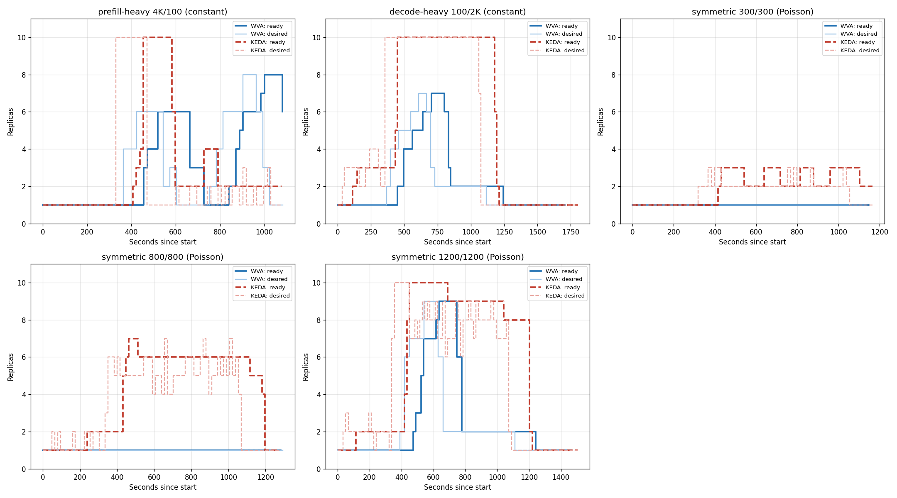
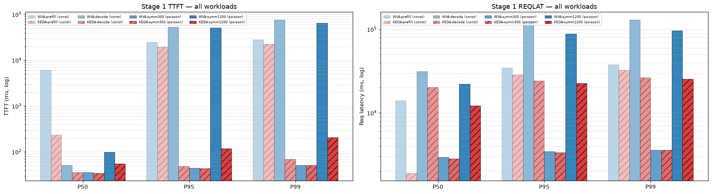
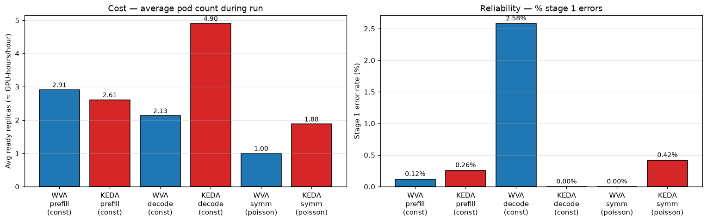

<!--
Table formatting rules for this doc (keep alignment readable in the raw editor):
  1. Every cell has exactly one space of padding inside the pipes (`| cell |`).
  2. Within a table, every row uses the SAME column widths. Widen a column to
     fit its widest cell — don't leave short cells un-padded.
  3. Text columns are left-aligned; numeric columns are right-aligned.
  4. The separator row uses dashes only, with a length matching the column width.
  5. Do not vary column widths between the header, separator, and data rows.
  Regenerate all tables via `hack/format-tables.py` if adding/removing rows.
-->

# WVA (Sat-2) vs KEDA-EPP autoscaling — fair comparison

Date: 2026-07-22 – 2026-07-24
Namespace: `biran` (pokprod001)
Model: `unsloth/Meta-Llama-3.1-8B-Instruct` (TP=1)
Harness: inference-perf v0.7.0

Ten back-to-back runs on the same cluster and model service (two constant-arrival workloads + three Poisson workloads, each run under both schedulers); only the autoscaling controller loop was swapped between runs.

## Setup

**WVA Sat-2**
- Metric feeding HPA: `wva_desired_replicas` — target computed by the WVA controller from KV supply + demand + EPP queue.
- Reconcile: 30 s.
- HPA trigger: `wva_desired_replicas` with threshold 1 (WVA emits the actual replica count directly).
- WVA algorithm: scaleUp when KV util > 85%; scaleDown boundary 70%.

**KEDA-EPP**
- Metric feeding HPA: two Prometheus queries — `sum(inference_extension_flow_control_queue_size)` and `sum(inference_objective_running_requests)`.
- Poll interval: 15 s.
- HPA triggers: `queue` avg/pod = 1; `running` avg/pod = 16.
- Purely reactive; HPA sees averages and scales linearly.

Both share the same KEDA HPA scaleUp/scaleDown behavior: Percent=100/15s, ScaleUp stab=0s, ScaleDown stab=120s. Both min=1, max=10.

Workloads (inference-perf, all 2 → 10 RPS with 5-min warm-up + 12-min saturation):
- **prefill-heavy** (constant arrival): input 4K tokens, output 100 tokens.
- **decode-heavy** (constant arrival): input 100 tokens, output 2K tokens.
- **symmetric 300/300** (Poisson arrival): input ≈300 tokens, output ≈300 tokens. Fits in one pod; probes scheduler stability under arrival jitter.
- **symmetric 800/800** (Poisson arrival): input ≈800 tokens, output ≈800 tokens. Sits right at one pod's KV capacity edge; probes the transition zone between the two workloads below/above.
- **symmetric 1200/1200** (Poisson arrival): input ≈1200 tokens, output ≈1200 tokens. **Exceeds one pod's KV capacity**, so both schedulers must scale; probes scale-up + scale-down behaviour under bursts.

**Load profile**: the two constant-arrival workloads use `load.type: constant` — requests fire at strictly fixed inter-arrival times. The third workload uses `load.type: poisson`, which draws inter-arrival intervals from an exponential distribution at the same mean rate. Poisson arrivals produce short bursts even at a modest mean and expose reactive schedulers' sensitivity to instantaneous rates.

## Results — stage 1 (10 RPS, 720 s)

### Reliability, throughput, replicas — constant arrival

| metric                      | WVA-prefill | KEDA-prefill | WVA-decode | KEDA-decode |
|-----------------------------|-------------|--------------|------------|-------------|
| requests                    |        7200 |         7200 |       7200 |        7200 |
| successful                  |        7191 |         7181 |       7014 |    **7200** |
| errors                      |           9 |           19 |    **186** |       **0** |
| error rate                  |       0.12% |        0.26% |  **2.58%** |   **0.00%** |
| achieved RPS                |       10.00 |        10.01 |      10.00 |       10.00 |
| avg ready replicas          |        2.91 |         2.61 |   **2.13** |    **4.90** |
| max ready                   |           8 |           10 |          7 |          10 |
| max desired                 |           8 |           10 |          7 |          10 |
| state transitions           |          17 |           14 |         14 |          13 |
| peak EPP flow-control queue |         208 |          206 |    **707** |       **2** |

### Latency (ms) — constant arrival

| metric              | WVA-prefill | KEDA-prefill |  WVA-decode | KEDA-decode |
|---------------------|-------------|--------------|-------------|-------------|
| TTFT p50            |        6190 |          237 |          51 |      **36** |
| TTFT p95            |      24,967 |       19,637 |  **53,324** |      **49** |
| TTFT p99            |      28,064 |       22,740 |  **76,708** |      **69** |
| TTFT mean           |        8949 |         3265 |        8593 |      **37** |
| Request latency p50 |      13,994 |         1904 |      31,481 |  **20,281** |
| Request latency p95 |      34,730 |       28,875 | **125,557** |  **24,324** |
| Request latency p99 |      38,018 |       32,561 | **130,776** |  **26,494** |
| TPOT p50            |        32.9 |         16.9 |        15.8 |    **10.2** |
| TPOT p95            |       128.9 |        117.7 |        51.4 |    **13.8** |

### Symmetric 300/300 — Poisson arrival

| metric                   |  WVA-symm | KEDA-symm |
|--------------------------|-----------|-----------|
| requests                 |      7200 |      7200 |
| successful               |  **7200** |      7170 |
| errors                   |     **0** |        30 |
| error rate               | **0.00%** |     0.42% |
| achieved RPS             |     10.00 |      9.81 |
| avg ready replicas       |  **1.00** |      1.88 |
| max ready                |     **1** |         3 |
| max desired              |         1 |         3 |
| state transitions        |         1 |        15 |
| TTFT p50 (ms)            |        36 |        35 |
| TTFT p95 (ms)            |        45 |        44 |
| TTFT p99 (ms)            |        52 |        52 |
| Request latency p50 (ms) |      2947 |      2831 |
| Request latency p95 (ms) |      3438 |      3356 |
| Request latency p99 (ms) |      3584 |      3579 |
| TPOT p50 (ms)            |       9.8 |       9.4 |
| TPOT p95 (ms)            |      15.6 |      14.6 |

Latency is statistically indistinguishable across the two schedulers on this workload — both easily satisfied the SLO with the pod capacity available. What differs is:
- **WVA held at exactly 1 replica the entire run** (1 transition = the initial state). It correctly predicted from KV supply-vs-demand that a single TP=1 pod had abundant headroom.
- **KEDA-EPP oscillated 1 → 2 → 3 → 2 → 3** across 15 state transitions because Poisson bursts briefly pushed the `inference_objective_running_requests` metric across the 16/pod threshold, even though the *mean* rate was well within one pod's capacity.
- Result: **KEDA-EPP spent 88 % more GPU-time and produced 30 errors while achieving statistically identical latency**. This is the clearest single-variant WVA advantage in the dataset: same SLO, roughly half the cost, no errors.

#### Why did more pods produce more errors?

Counter-intuitive at first — but the KEDA errors are *caused by* the extra scaling. Inspecting `per_request_lifecycle_metrics.json`:
- 29 of 30 errors are `ClientPayloadError: "Response payload is not complete"` (streaming response cut mid-body).
- The 30th is `HTTP Error 502` (bad gateway).
- **All 30 fire in the same ~1-second window at t+516 s** into the run, which exactly matches the first KEDA scale-down event (`decode ready 3 → 2` at 20:43:37 UTC).
- Failed requests each ran for ~30–33 s before erroring — the time they had been streaming from the pod that received SIGTERM.

Root cause chain: Poisson burst → `running_requests` transiently > 16/pod → KEDA scales up → burst ends → scaleDown stabilization window (120 s) elapses → KEDA scales down → SIGTERM to a busy pod → in-flight streams die with `ClientPayloadError`. WVA never scaled, so no terminations, so no disruption. **Fewer pods produced fewer errors because the pods that existed were stable.**

### Symmetric 800/800 — Poisson arrival (intermediate scale point)

At 800 in + 800 out tokens, load sits right at the edge of one pod's KV capacity — a middle point between symmetric 300/300 (fits in 1 pod) and symmetric 1200/1200 (clearly needs 9–10 pods).

| metric                   |    WVA-800 | KEDA-800 |
|--------------------------|------------|----------|
| requests                 |       7200 |     7200 |
| successful               |   **7200** |     7186 |
| errors                   |      **0** |       14 |
| error rate               |  **0.00%** |    0.19% |
| achieved RPS             |       9.84 |     9.90 |
| avg ready replicas       |   **1.00** |     4.06 |
| max ready                |      **1** |        7 |
| max desired              |      **1** |        7 |
| state transitions        |      **1** |        8 |
| TTFT p50 (ms)            |       83.3 | **42.8** |
| TTFT p95 (ms)            |      125.7 | **66.3** |
| TTFT p99 (ms)            |      149.7 | **86.7** |
| Request latency p50 (ms) |     15,573 | **7760** |
| Request latency p95 (ms) |     18,856 | **9159** |
| Request latency p99 (ms) |     20,063 | **9721** |
| TPOT p50 (ms)            |       19.9 |  **9.7** |
| TPOT p95 (ms)            |       35.7 | **17.9** |

**A clear cost/reliability-vs-latency tradeoff at exactly the capacity edge.** WVA's controller logs (captured cleanly on this run) show KV utilization peaked at **64%** — never crossing the 85% scaleUp threshold — so it correctly, consistently held at 1 replica for the entire run. That makes WVA **4× cheaper** (1.00 vs 4.06 avg pods) and **more reliable** (0 vs 14 errors) than KEDA-EPP here, but at roughly **2× the latency** across every percentile: one pod queues the full 10 RPS Poisson load instead of spreading it across ~4.

KEDA-EPP's 14 errors reproduce the same pattern documented above: all fire in the same ~1-second window (`ClientPayloadError`, mid-stream cut) at a scale-down event.

*Note on reproducibility: an earlier attempt at this exact workload (same config, different Poisson draw) showed WVA ramping to 6 replicas instead of holding at 1 — its controller logs were lost to a process interruption before they could be captured, so that run isn't included here. Since inference-perf's Poisson arrivals aren't seed-fixed, two runs at the same nominal 10 RPS can land on opposite sides of an 85%-utilization threshold purely from randomness in the burst pattern — symmetric 800/800 was chosen specifically because it sits at that edge. This run's numbers are used above because its controller-decision data (supply/demand/utilization per reconcile) was fully captured, unlike the discarded one.*

### Symmetric 1200/1200 — Poisson arrival (both must scale)

At 1200 in + 1200 out tokens per request, one pod's KV supply (~336 K tokens) is no longer enough at 10 RPS — both schedulers had to scale up.

| metric                   | WVA-1200 |  KEDA-1200 |
|--------------------------|----------|------------|
| requests                 |     7200 |       7200 |
| successful               |     7096 |   **7174** |
| errors                   |      104 |     **26** |
| error rate               |    1.44% |  **0.36%** |
| achieved RPS             |    10.08 |       9.78 |
| avg ready replicas       | **2.45** |       5.16 |
| max ready                |        9 |         10 |
| max desired              |        9 |         10 |
| state transitions        |       13 |         14 |
| TTFT p50 (ms)            |     99.4 |   **55.2** |
| TTFT p95 (ms)            |   51,483 |    **119** |
| TTFT p99 (ms)            |   65,059 |    **209** |
| Request latency p50 (ms) |   22,126 | **12,160** |
| Request latency p95 (ms) |   88,573 | **22,617** |
| Request latency p99 (ms) |   97,081 | **25,576** |
| TPOT p50 (ms)            |     18.0 |   **10.1** |
| TPOT p95 (ms)            |     37.7 |   **19.9** |

**KEDA-EPP wins here on almost every axis — reliability, TTFT, tail latency, TPOT — at ~2.1× the compute cost.**

#### What went wrong with WVA on 1200/1200

WVA reacted quickly and correctly to the arriving load — its `wva_desired_replicas` ramped `1 → 2 → 7 → 9` in about 90 s. But once **all 9 pods came online at T+4:20**, the WVA analyzer instantly reassessed the demand model: 9 pods of ~336 K KV supply = ~3 M tokens supply vs a current KV usage of ~200 K tokens, i.e. util ~7 %. That crossed the scaleDown boundary (70 %) hard, so WVA emitted target=2 **while stage 1 was still active**. HPA started terminating pods within the next ~120 s (scaleDown stabilization). The 104 errors correlate to the pod-termination window — the same `ClientPayloadError` mid-stream pattern as the 300/300 KEDA case, but this time WVA is the one causing it.

Contrast with KEDA-EPP, which keyed off `running_requests` (not "spare KV capacity"): pods stayed busy, `running_avg` stayed above 12/pod, so the scaleDown-below-threshold condition simply didn't fire during stage 1. It only scaled down after the harness stopped emitting load.

WVA is more measured at ramp-up but too eager at ramp-down: it releases capacity as soon as "supply comfortably exceeds current in-use demand", without accounting for the fact that the mid-flight requests holding those pods busy can't survive a pod restart.

## Graphs

*The replicas-over-time chart below covers all 5 workloads. The latency and cost/error charts further down still predate the symmetric 800/800 run and show only the original 4 workloads — per-run pipeline plots for 800/800 exist at `<results dir>/metrics/graphs/two_variant_v2_full_pipeline.png` for each of the two runs listed under Reproducing.*

### Replicas over time

- **Prefill 4K/100 (constant)**: WVA climbs to 8 in ~9 min. KEDA-EPP rockets 1→10 in ~45 s, then oscillates 1↔4↔2↔3 as the queue metric bounces.
- **Decode 100/2K (constant)**: WVA climbs to 7 then drops to 1 mid-run (WVA's 186 errors happen at that drop). KEDA-EPP holds at 10 for the entire stage 1, drops only after load ends.
- **Symmetric 300/300 (Poisson)**: WVA stays flat at 1 (correct — the load fits in one pod). KEDA-EPP oscillates 1↔2↔3 because Poisson bursts trip the `running_requests > 16/pod` threshold intermittently.
- **Symmetric 800/800 (Poisson)**: WVA stays flat at 1 the entire run (KV util peaked at 64%, under its 85% scaleUp threshold). KEDA-EPP ramps to 6–7 and holds there for most of stage 1 — the two curves visually make the cost/latency tradeoff in this section's table obvious.
- **Symmetric 1200/1200 (Poisson)**: WVA climbs to 9 then drops to 2 as soon as all pods come online (this drop causes 104 errors from in-flight-stream termination). KEDA-EPP climbs to 10 and holds throughout stage 1.

### Latency — TTFT and request latency at each percentile (log scale)

- On the constant-arrival workloads (prefill + decode), KEDA-EPP wins at every percentile.
- On symmetric 300/300 Poisson, WVA and KEDA-EPP bars are visually indistinguishable — both easily meet SLO.
- On symmetric 1200/1200 Poisson, KEDA-EPP again wins on every percentile, most dramatically at p95/p99 (log scale): KEDA is 100–200 ms while WVA is 50+ seconds.

### Cost and error rate side-by-side

- **prefill-heavy (constant)**: KEDA-EPP slightly cheaper AND lower TTFT — WVA has no advantage.
- **decode-heavy (constant)**: WVA cheaper (2.13 vs 4.90 pods) but trades that for 2.58 % errors and multi-second tail-latency inflation.
- **symmetric 300/300 (Poisson)**: WVA holds at 1 pod with 0 errors; KEDA-EPP spends 88 % more GPUs and has 30 errors for equivalent latency. **Clear WVA win — headroom scenario.**
- **symmetric 1200/1200 (Poisson)**: WVA cheaper (2.45 vs 5.16 pods) but 4× more errors and 200× worse tail latency (p99 65 s vs 209 ms). WVA released capacity mid-run once pods came online; those terminations killed 104 in-flight streams.

## Reading these numbers

**Where KEDA-EPP wins (saturating workloads that require scaling):**
1. **Reliability on decode-heavy**: 0 errors (WVA: 186).
2. **Reliability on symmetric 1200/1200 Poisson**: 26 errors (WVA: 104).
3. **TTFT tail** across all saturating workloads — several orders of magnitude better at p95/p99.
4. **Slight edge on prefill-heavy cost**: 2.61 vs 2.91 avg replicas.

**Where WVA wins (headroom present, load fits in one pod):**
1. **Symmetric 300/300 with Poisson**: same latency, 88 % less compute, zero errors vs 30. Model-aware demand estimation refuses to react to bursts that fit inside the current pod's KV capacity.
2. **Model-aware demand estimation** in general: WVA won't scale up on transient noise that doesn't reflect sustained pressure.

**Where WVA trades latency for cost and reliability (right at one pod's capacity edge):**
- **Symmetric 800/800 Poisson**: WVA held at 1 replica the whole run (KV util peaked at 64%, below its 85% scaleUp threshold) — 4× cheaper and zero errors vs KEDA-EPP's 4.06 avg pods and 14 errors, but ~2× the latency at every percentile. Whether WVA scales here at all is sensitive to the specific (non-seeded) Poisson realization — a different run of the identical config showed it ramping to 6 pods instead. This is the transition zone between WVA's headroom advantage (300/300) and KEDA's saturation advantage (1200/1200): the outcome is genuinely workload-realization-dependent, not a stable middle ground.

**A recurring failure mode — mid-run scale-down killing in-flight streams:**
Both schedulers exhibit it, at different times:
- **KEDA-EPP on 300/300 Poisson** (T+516 s): running_requests briefly dropped, HPA scaled 3→2, streaming client on the terminating pod got `ClientPayloadError` × 30.
- **WVA on 1200/1200 Poisson** (T+4:20): once all 9 pods came online, WVA re-computed util as ~7 % (target dropped 9→2), triggering cascade of terminations. 104 in-flight streams died with the same `ClientPayloadError`.
- **WVA on decode-heavy constant** (mid-stage-1): same pattern — 186 errors from terminating pods mid-stream.

Neither scheduler currently accounts for "how many in-flight streaming requests would die if I terminate this pod right now?" — the KEDA HPA `terminationGracePeriodSeconds` + vLLM's shutdown handling could bridge this, but neither is tuned for the multi-second inference latency here.

**What single-variant experiments don't measure — WVA's cost-aware optimizer:**
- WVA's cost-aware V2 optimizer only differentiates variants when there are **multiple variants** (e.g., primary at TP=2 and secondary at TP=1 with different `cost` weights). All 10 runs above use a single TP=1 variant, so WVA's efficiency-vs-latency tradeoff collapses to "hold min pods that satisfy the demand model" — a scenario the current threshold configuration doesn't handle well under sustained load.
- KEDA-EPP's two triggers (`queue`=1 and `running`=16) were picked to match the WVA setup's intent, but at these thresholds KEDA is biased to over-react on any load mild enough that WVA would ignore it.

## Honest conclusions

1. **KEDA-EPP is aggressive; WVA is measured.** Aggression wins on saturating workloads; measure wins on workloads with real headroom.
2. **The clearest single-variant WVA advantage is at symmetric 300/300 Poisson**: same SLO, 88 % less compute, zero errors. When the load truly fits in one pod, WVA correctly refuses to react to Poisson noise. Any workload with real-world arrival jitter and headroom-to-spare replicates this shape.
3. **At exactly the capacity edge (symmetric 800/800 Poisson), WVA's outcome depends on the specific Poisson draw, not just the mean rate.** In the run reported here, WVA held at 1 replica (KV util peaked at 64%, under its 85% threshold) — 4× cheaper and zero errors vs KEDA-EPP, but ~2× the latency. A different run of the identical config crossed the threshold and ramped to 6 pods instead. Because inference-perf's Poisson arrivals aren't seed-fixed, this workload can't be treated as a single stable data point — it's a real illustration of threshold-based scaling's sensitivity to burst timing near a boundary.
4. **WVA under-performs on any workload that saturates a pod under sustained load.** Its scaleUpThreshold (85 % KV util) and scaleDown boundary (70 %) trigger a target-drop the moment all pods become ready — releasing capacity while load is still active and causing streaming errors. Two straightforward tuning knobs would help: (a) raise scaleDown boundary so pods stay longer once brought up, (b) add a "min pods to hold during stage 1" hysteresis so mid-run releases don't churn.
5. **The full two-variant WVA story remains unexplored here.** Prior work (`project-two-variant-experiment`) showed WVA ~36 % cheaper than HPA-EPP-50/50 at equal SLO with two variants. That's the head-to-head that would show WVA's design payoff on its intended axis.

## Recommendations

- **Workloads that comfortably fit in one pod** even under Poisson jitter (small tokens, low concurrency): **prefer WVA** — model-aware estimator refuses to over-react to noise. Saves ~2× compute at identical SLO.
- **Workloads that saturate at 10 RPS or higher with tight tail-latency SLOs**: **prefer KEDA-EPP** — aggressive reactive scaling keeps tail latency 1–3 orders of magnitude tighter than WVA's current defaults, at the cost of ~2× the pods. WVA cannot compete here without threshold tuning.
- **Two-variant deployments (primary TP=2 + secondary TP=1)**: **use WVA** — this is its designed sweet spot, and single-variant experiments here don't exercise the cost-aware optimizer. Rerun of these workloads on a two-variant install is the natural next step.
- **WVA tuning knobs to explore for saturating workloads**:
  - Raise `scaleDownBoundary` from 0.7 → 0.5 (hold pods once brought up, only release when demand is drastically lower).
  - Add a "hysteresis" or "hold pods for N minutes after scale-up" heuristic so a target=9 doesn't collapse to target=2 within 90 s.
  - Include an EPP-queue-size term in the demand estimator (or in the scaleUp trigger) so WVA reacts before the queue backs up.
  - Consider a graceful drain / `terminationGracePeriodSeconds` >> average inference time so pod-terminate never severs an in-flight stream.

## Reproducing

Each run is at:

| run                                    | results dir                                                             |
|----------------------------------------|-------------------------------------------------------------------------|
| WVA prefill (const)                    | `biran-20260722-004826-094/results/inference-perf-1784670547-tavc00_1/` |
| WVA decode (const)                     | `biran-20260722-143624-638/results/inference-perf-1784720225-bhhjh1_1/` |
| KEDA-EPP prefill (const)               | `biran-20260722-162141-516/results/inference-perf-1784726545-fli9qm_1/` |
| KEDA-EPP decode (const)                | `biran-20260722-164602-489/results/inference-perf-1784728018-vsnfl4_1/` |
| WVA symmetric 300/300 (poisson)        | `biran-20260722-223301-790/results/inference-perf-1784748830-ge3fgu_1/` |
| KEDA-EPP symmetric 300/300 (poisson)   | `biran-20260722-233247-978/results/inference-perf-1784752466-0yjpyg_1/` |
| WVA symmetric 800/800 (poisson)        | `biran-20260724-173729-660/results/inference-perf-1784903893-ys0vog_1/` |
| KEDA-EPP symmetric 800/800 (poisson)   | `biran-20260724-102958-963/results/inference-perf-1784878246-kwssn1_1/` |
| WVA symmetric 1200/1200 (poisson)      | `biran-20260723-154507-242/results/inference-perf-1784810752-pbd8hi_1/` |
| KEDA-EPP symmetric 1200/1200 (poisson) | `biran-20260723-174703-702/results/inference-perf-1784818070-8c8wez_1/` |

KEDA-EPP ScaledObject: `hack/benchmark/scenarios/keda-epp/scaledobject.yaml`.
Poisson workload profiles: `test/benchmark/scenarios/symmetrical_300_2_10_poisson.yaml.in`, `symmetrical_1200_2_10_poisson.yaml.in`.
Swap procedure (in place, no teardown): pause WVA controller (`kubectl scale deploy/wva-controller-manager --replicas=0`), delete the WVA ScaledObject, apply the keda-epp one, run, then restore.
